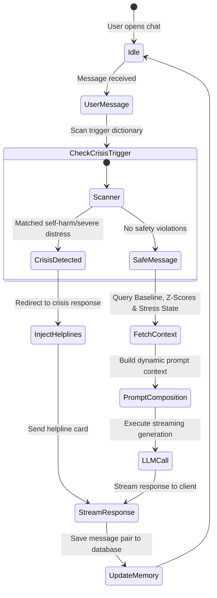

# MindGuard AI Wellness Coach Blueprint
## Enterprise Conversational AI, Context Injection Prompt Builder, and Safety Guardrails

This document details the production-ready architecture for the **AI Wellness Coach** of MindGuard AI. The coach acts as the primary conversational interface for users, integrating data from the Digital Lifestyle Twin, Behavior Analysis, and Stress Estimation engines to deliver personalized, safe wellness guidance.

---

## 1. AI Wellness Coach Architecture

The AI Wellness Coach is structured as a pipeline that intercepts chat inputs, enriches them with user state data, and validates outputs against safety guidelines.

```
       [User Chat Input]
               │
               ▼
  ┌────────────────────────────────────────────────────────┐
  │ 1. Session Guard & Memory Retriever                    │
  │    - Extract JWT context & fetch chat history          │
  └────────────────────────┬───────────────────────────────┘
                           │ Active Session & History
                           ▼
  ┌────────────────────────────────────────────────────────┐
  │ 2. Dynamic Prompt Builder                              │
  │    - Ingest Twin Baseline, Deviations, & Stress State  │
  └────────────────────────┬───────────────────────────────┘
                           │ Fully Context-Enriched Prompt
                           ▼
  ┌────────────────────────────────────────────────────────┐
  │ 3. LLM Client Gateway                                  │
  │    - Provider-agnostic LLM wrapper (Gemini, Claude...) │
  └────────────────────────┬───────────────────────────────┘
                           │ Raw Response Stream
                           ▼
  ┌────────────────────────────────────────────────────────┐
  │ 4. Safety Guardrail Filter                             │
  │    - Check for clinical terms, diagnosis, & crisis keys│
  └────────────────────────┬───────────────────────────────┘
                           │ Validated Stream
                           ▼
       [Client App Chat UI] (SSE / WebSockets Streaming)
```

---

## 2. Conversation Flow

Conversations are managed as state transitions, shifting contexts based on user inputs and analyzed habit changes.



---

## 3. Prompt Engineering Architecture

The **Dynamic Prompt Builder** compiles structural prompt templates, injecting active context from the database into the LLM context window:

```
┌────────────────────────────────────────────────────────────────────────┐
│                        Dynamic Prompt Template                         │
├───────────────┬────────────────────────────────────────────────────────┤
│ System Prompt │ Role instructions, empathetic tone, and safety rules   │
├───────────────┼────────────────────────────────────────────────────────┤
│ User Baseline │ sleep = 8h, screen = 4h, unlocks = 60, exercise = 30m   │
├───────────────┼────────────────────────────────────────────────────────┤
│ Today's State │ sleep = 5.5h, screen = 7.5h, unlocks = 120             │
├───────────────┼────────────────────────────────────────────────────────┤
│ Stress State  │ Elevated (72% likelihood) due to sleep loss & device use│
├───────────────┼────────────────────────────────────────────────────────┤
│ Goals         │ "Sleep earlier", "Meditate daily"                      │
├───────────────┼────────────────────────────────────────────────────────┤
│ Chat History  │ Last 5 message exchanges (sliding window memory)       │
├───────────────┼────────────────────────────────────────────────────────┤
│ User Input    │ "I feel overwhelmed, what should I do?"                │
└───────────────┴────────────────────────────────────────────────────────┘
```

---

## 4. Context Memory Design

To maintain context without exceeding token limits, we implement a three-tiered memory model:

```
                             [ User Session Chat ]
                                       │
         ┌─────────────────────────────┼─────────────────────────────┐
         ▼                             ▼                             ▼
┌──────────────────┐          ┌──────────────────┐          ┌──────────────────┐
│ Short-Term (STM) │          │ Long-Term (LTM)  │          │ Semantic Memory  │
│ Sliding window   │          │ User profile DB, │          │ Vectorized summaries│
│ of last 6 logs   │          │ goals, pref keys │          │ of past threads  │
└──────────────────┘          └──────────────────┘          └──────────────────┘
```

1.  **Short-Term Memory (STM):** A sliding window of the last 6 message exchanges, keeping the immediate conversation context active.
2.  **Long-Term Memory (LTM):** Persists user metadata, preferences, and goals in the database.
3.  **Semantic Memory (Future Vector Store):** Summarizes older conversations and stores them in a vector database for semantic retrieval during subsequent chat sessions.

---

## 5. Personalization Strategy

The engine enforces personalization rules, requiring recommendations to reference the user's specific baseline deviations:
*   *Generic Response:* *"Exercise is good for stress reduction."*
*   *Personalized Response:* *"Your exercise duration dropped from 30 minutes to 10 minutes this week. Returning to your previous routine may help improve your focus."*

---

## 6 & 7. Recommendation & Habit Coaching Engines

The coach uses structured rules to help users build and maintain healthy habits:
*   **Habit Formation:** Suggests small changes based on current habits (e.g. suggesting a 5-minute meditation block after a detected focus session).
*   **Habit Recovery:** Automatically detects when a habit has dropped (e.g., exercise frequency dropping by 50%) and prompts the user to rebuild their streak.
*   **Habit Streaks:** Visualizes consistency streaks in the chat interface to encourage positive behavior.

---

## 8. Goal Management System

Users can set and track goals directly through the chat interface:
1.  **Goal Setup:** The user configures goals (e.g. *"Reduce screen time to under 4 hours"*).
2.  **Progress Tracking:** The engine queries daily logs and reports progress during chat interactions.
3.  **Reframing:** If the user fails to meet their goal, the coach suggests adjustments to make the goal more achievable.

---

## 9. Report Generation Pipelines

The coach generates automated reports summarizing the user's habits:
*   **Daily Wellness Report:** Highlights today's metrics, wins, and habit deviations.
*   **Weekly Summary:** Tracks weekly progress, highlighting improvements and areas to focus on next week.
*   **Monthly Evolution:** Compares monthly baselines to show long-term habit trends.

---

## 10. Explainable AI (XAI) Strategy

When explaining habit changes, the coach follows a structured template:
*   **Observation:** The detected habit change (e.g. sleep duration decreased).
*   **Reason:** The primary contributing factor (e.g. screen time increased after 10 PM).
*   **Evidence:** The statistical details (e.g. bedtime shifted by 75 minutes).
*   **Actionable Tip:** A practical suggestion to address the deviation.

---

## 11 & 12. Ethical AI & Crisis Handling Framework

MindGuard AI enforces safety guidelines and crisis management rules:
1.  **Non-Medical Role:** The system prompts enforce a non-medical role: *"You are a wellness coach, not a doctor. Never diagnose, prescribe, or use clinical terms."*
2.  **Crisis Detection Scanner:** Every message is scanned for crisis indicators (e.g. indicators of self-harm or severe emotional distress).
3.  **Crisis Response:** If a crisis indicator is detected, the system overrides LLM generation and displays crisis resources:
    *   *System Response:* *"If you are experiencing severe distress, please reach out for support. You can contact the National Suicide Prevention Lifeline by calling or texting 988 (USA), or reach out to local emergency services."*

---

## 13. Retrieval-Augmented Generation (RAG) Architecture

To provide validated wellness guidance, we design a RAG pipeline to retrieve relevant research articles:

```
  [User Question] ──► [Query Embeddings] ──► [Vector DB: Chroma]
                                                      │
                                            Retrieve top articles
                                                      │
                                                      ▼
  [LLM Response Generation] ◄── [Context Injection] ◄─┘
```

*   **Ingestion Pipeline:** Pre-processes, chunks, and indexes verified wellness guides, sleep hygiene research, and meditation instructions.
*   **Vector Database:** Stores document chunk embeddings using Chroma or PGVector.
*   **Prompt Augmentation:** Injects the retrieved document context into the LLM prompt, ensuring recommendations are backed by evidence.

---

## 14. Signature-Agnostic LLM Gateway

We implement a provider-agnostic LLM interface wrapper to allow swapping LLM providers (Google Gemini, Anthropic Claude, OpenAI, or local Llama deployments) without code changes.

```python
class LLMClientGateway:
    def __init__(self, provider: str, api_key: str):
        self.provider = provider
        self.api_key = api_key

    async def generate_stream(self, system_prompt: str, prompt: str) -> AsyncIterable[str]:
        if self.provider == "gemini":
            # Native Google Gemini stream execution logic
            ...
        elif self.provider == "anthropic":
            # Anthropic Claude stream execution logic
            ...
```

---

## 15. Database Integration

The AI Coach writes conversations and message logs to the MySQL database:
*   `ai_conversations`: Stores conversation metadata and session details.
*   `ai_messages`: Stores encrypted message logs.
*   `ai_recommendations`: Stores generated wellness recommendations.
*   `ai_recommendation_feedbacks`: Stores user feedback ratings (+/-) to help evaluate recommendation quality.

---

## 16. FastAPI Integration

The AI Coach exposes the following endpoints:
*   `GET /api/v1/coach/conversations`: Returns a list of active conversation threads for the user.
*   `POST /api/v1/coach/chat/stream`: Establishes a Server-Sent Events (SSE) connection to stream coach responses.
*   `POST /api/v1/coach/recommendations/{id}/feedback`: Logs user feedback for recommendations.

---

## 17. Security Architecture

*   **Message Encryption:** Chat history (`message_text_encrypted` inside `ai_messages`) is encrypted at rest using AES-256-GCM.
*   **Conversational Data Deletion:** Users can delete their conversation history. Deleting a conversation executes a cascade delete, removing all associated message logs.
*   **Access Control:** The API verifies that the requesting user owns the conversation ID before retrieving message history.

---

## 18. Scalability Plan

*   **Server-Sent Events (SSE):** Streaming responses are sent using Server-Sent Events, which are more lightweight and resource-efficient than WebSockets for uni-directional streaming.
*   **Context Truncation:** To manage context window sizes, older messages are summarized and pruned from the active prompt context.
*   **Redis Caching:** Static prompt system instructions and user profiles are cached in Redis to minimize database lookups.

---

## 19. Future AI Expansion

*   **Multi-Language Translation Support:** Dynamically translates LLM prompts and responses to support English, Tamil, and Hindi.
*   **Voice Conversation Interface:** Connects Speech-to-Text (STT) and Text-to-Speech (TTS) models to the chat pipeline to enable voice interactions.

---

## 20. AI Coach Development Roadmap

```
  ┌────────────────────────────────────────────────────────┐
  │ Phase 1: LLM Client classes & dynamic prompt builder   │
  └───────────────────────────┬────────────────────────────┘
                              │
                              ▼
  ┌────────────────────────────────────────────────────────┐
  │ Phase 2: Session memory & Encryption DB tables         │
  └───────────────────────────┬────────────────────────────┘
                              │
                              ▼
  ┌────────────────────────────────────────────────────────┐
  │ Phase 3: Crisis detection & Safety filter middleware   │
  └───────────────────────────┬────────────────────────────┘
                              │
                              ▼
  ┌────────────────────────────────────────────────────────┐
  │ Phase 4: SSE streaming integration & Client UI tests   │
  └────────────────────────────────────────────────────────┘
```

1.  **Phase 1 (Foundations):** Build the provider-agnostic LLM client classes and verify connection parameters.
2.  **Phase 2 (Memory & DB):** Build session memory handlers, implement AES-256-GCM encryption, and save chat logs to the database.
3.  **Phase 3 (Safety Guardrails):** Implement crisis detection scanners and test safety filters with validation inputs.
4.  **Phase 4 (Streaming Integration):** Configure SSE endpoints, verify streaming responses on Android and Web clients, and optimize performance.
