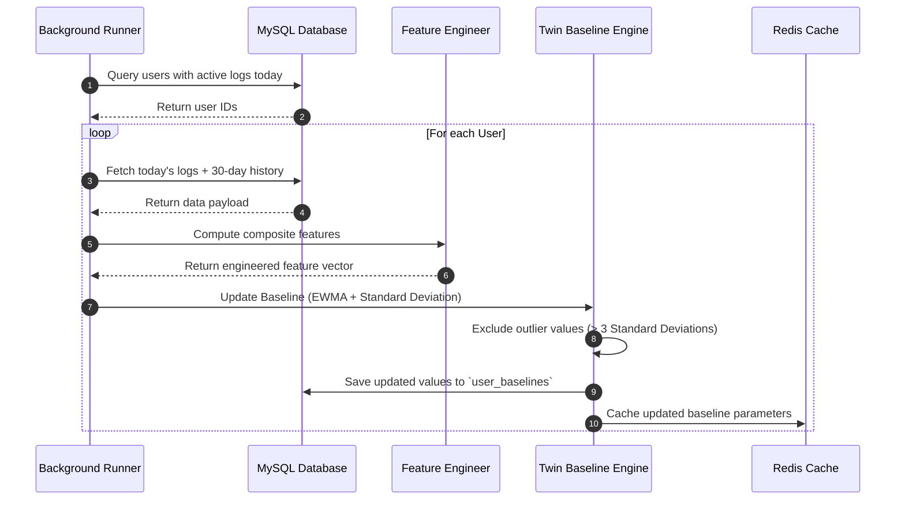
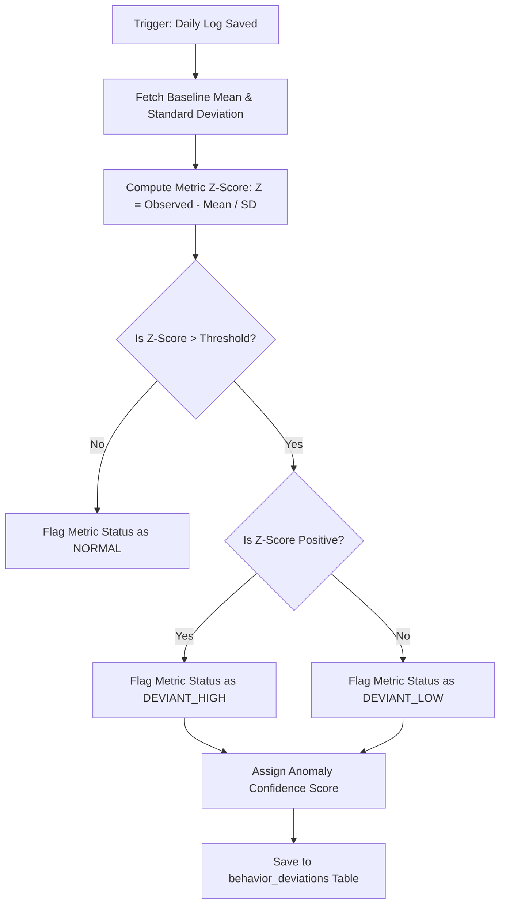

# MindGuard AI Digital Lifestyle Twin Blueprint
## Flagship AI Engine Architecture & Statistical Learning Models

This document details the production-ready machine learning and statistical learning architecture for the **Digital Lifestyle Twin Engine** (DLTE), the core innovation of MindGuard AI. The engine models, learns, and updates a user's normal baseline habits dynamically, performing intra-individual comparisons to detect behavioral drifts and estimate stress risk.

---

## 1. Digital Lifestyle Twin Architecture

The Digital Lifestyle Twin Engine acts as an isolated analytical layer that receives raw lifestyle log streams, processes them through a feature engineering pipeline, models the user's baseline, and outputs statistical deviation matrices to the Stress Estimation and AI Coach engines.

```
       [Raw User Activity Stream]
                   │ (Daily Logs, Mood, Journal)
                   ▼
  ┌────────────────────────────────────────────────────────┐
  │ 1. Feature Engineering Pipeline                        │
  │    - Compute SCS, LSI, BSS, and rolling trend slopes   │
  └────────────────────────┬───────────────────────────────┘
                           │ Prepared Feature Vectors
                           ▼
  ┌────────────────────────────────────────────────────────┐
  │ 2. Statistical Baseline Learning Core                  │
  │    - Compute rolling EWMA averages and variance (σ)    │
  └────────────────────────┬───────────────────────────────┘
                           │ Baseline Parameters update
                           ▼
  ┌────────────────────────────────────────────────────────┐
  │ 3. Comparison & Anomaly Engine                         │
  │    - Compute Z-Scores and detect habit deviations      │
  └────────────────────────┬───────────────────────────────┘
                           │ Anomaly Matrices
                           ▼
  ┌────────────────────────┴───────────────────────────────┐
  │ 4. Downstream Consumers                                │
  │    - Stress Engine ──► AI Coach ──► Web & Mobile UI    │
  └────────────────────────────────────────────────────────┘
```

---

## 2. AI Learning Workflow

The learning workflow operates on a nightly schedule, reading a user's activity logs for the day and updating their baseline statistics in the database.



---

## 3. Baseline Learning Strategy

Rather than using static thresholds, the baseline uses two primary mathematical concepts: **Exponentially Weighted Moving Averages (EWMA)** and **Moving Standard Deviation**.

### 3.1 Exponentially Weighted Moving Average (EWMA)
To allow the baseline to adapt over time while maintaining stability against single-day anomalies, we calculate rolling averages using:

$$\mu_{t} = \alpha \cdot X_{t} + (1 - \alpha) \cdot \mu_{t-1}$$

*   **$X_{t}$**: The observed metric value for day $t$.
*   **$\mu_{t}$**: The updated baseline average.
*   **$\alpha$ (Smoothing Factor):** Set to `0.07` for steady-state learning (~14 days to adapt).

### 3.2 Standard Deviation ($\sigma$)
We calculate the moving standard deviation to measure the variance of the user's habits:

$$\sigma_{t} = \sqrt{\beta \cdot (X_{t} - \mu_{t})^2 + (1 - \beta) \cdot \sigma_{t-1}^2}$$

*   **$\beta$**: Variance smoothing factor, set to `0.05`.
*   A lower standard deviation ($\sigma$) indicates a stable routine, while a higher value indicates variable habits.

---

## 4. Learning Stages

```
   Stage 1: Cold Start ──► Stage 2: Calibration ──► Stage 3: Adaptive ──► Stage 4: Stable Evolution
      (Days 1 - 7)            (Days 8 - 14)          (Days 15 - 90)             (Days 91+)
```

1.  **Stage 1: Cold Start (Days 1–7):** The system gathers raw data. No statistical assumptions are made, and deviations are not flagged. The UI displays onboarding metrics.
2.  **Stage 2: Temporary Calibration (Days 8–14):** Calculates temporary baseline parameters using simple averages. Standard deviations are initialized with default values, and deviations are flagged with low confidence.
3.  **Stage 3: Adaptive Learning (Days 15–90):** The EWMA model is activated. The system begins detecting behavior deviations and triggers stress analysis alerts.
4.  **Stage 4: Stable Evolution (Days 91+):** The baseline stabilizes. The system takes regular snapshots of the baseline to track long-term habit changes over seasons.

---

## 5. Twin Components

The Digital Lifestyle Twin is composed of several specialized sub-components, each modeling a specific domain:

```
                                  ┌────────────────────────┐
                                  │  Digital Twin Model    │
                                  └───────────┬────────────┘
                                              │
         ┌───────────────┬────────────────────┼────────────────────┬───────────────┐
         ▼               ▼                    ▼                    ▼               ▼
┌────────────────┐┌──────────────┐    ┌──────────────┐     ┌──────────────┐┌──────────────┐
│ Lifestyle Twin ││ Routine Twin │    │ Wellness Twin│     │ Focus Twin   ││ Behavior Twin│
│ Sleep/Screen   ││ Wake/Bedtime │    │ Mood/Journal │     │ Pomodoro     ││ Deviation    │
│ Minutes        ││ Intervals    │    │ Sentiment    │     │ Productivity ││ Matrices     │
└────────────────┘└──────────────┘    └──────────────┘     └──────────────┘└──────────────┘
```

*   **Lifestyle Twin:** Models daily physical activities and habits (e.g. sleep duration, screen time, water intake).
*   **Routine Twin:** Models temporal patterns, such as bedtime, wake time, and focus session start times.
*   **Wellness Twin:** Models emotional baselines, including mood ratings and journal sentiment scores.
*   **Focus Twin:** Models productivity habits, tracking focus durations and distraction rates.
*   **Behavior Twin:** Models deviation rates, tracking how frequently the user's habits drift from their baseline.

---

## 6. Feature Engineering Pipeline

The engine translates raw logs into composite metrics to capture routine stability and quality:

### 6.1 Sleep Consistency Score (SCS)
Measures variation in sleep schedules by calculating the standard deviation of bedtime and wake-up times:

$$SCS = 100 - \left( w_1 \cdot \sigma_{\text{bedtime\_hours}} + w_2 \cdot \sigma_{\text{wake\_hours}} \right)$$

*   A higher score (closer to 100) indicates a consistent sleep schedule.

### 6.2 Lifestyle Stability Index (LSI)
Measures overall routine consistency by calculating a weighted average of standard deviations across core habits:

$$LSI = 100 - \frac{1}{n}\sum_{i=1}^{n}\left(\frac{\sigma_i}{\mu_i} \cdot 100\right)$$

*   Reflects the overall variability of the user's habits.

---

## 7. Deviation Detection Workflow

The engine evaluates daily metrics against the baseline, flagging significant changes using statistical $Z$-scores.



### Anomaly Confidence Assignment:
The confidence score of a detected deviation ($C_{dev}$) is determined by:

$$C_{dev} = 1.0 - e^{-0.1 \cdot N_{\text{baseline\_days}}}$$

*   **$N_{\text{baseline\_days}}$**: The number of training days in the baseline.
*   Ensures deviation alerts are only triggered once the system has gathered sufficient historical data.

---

## 8. Behavior Comparison Workflow

The engine compares habits across different timeframes to detect long-term behavioral changes.
*   **Short-Term Shifts (Today vs. Yesterday):** Detects immediate daily changes (e.g. acute sleep deprivation).
*   **Mid-Term Changes (7-Day Average vs. 30-Day Baseline):** Detects emerging habit changes (e.g. a gradual increase in daily screen time).
*   **Long-Term Drift (30-Day Average vs. Historical Snapshots):** Measures gradual lifestyle changes using the **Population Stability Index (PSI)** to identify shifts in routine.

---

## 9. Insight Generation Workflow

The insight engine translates statistical anomalies into natural-language summaries.

```
 [Anomaly Matrix: sleep_duration Z = -2.1] ──► [Insight Generator Engine]
                                                       │
                                            Match templates in memory
                                                       │
                                                       ▼
                        [Generated Insight Model Output]
                        Observation: Sleep duration decreased.
                        Reason: late-night phone unlocks increased by 65%.
                        Confidence: High (92%)
                        Actionable Tip: Lock your phone 30m before bedtime.
```

### Dynamic Rules for Translation:
*   If `metric = screen_time` and `deviation_ratio > 1.50`, output: *"Your screen time increased by [X]% compared to your normal baseline."*
*   If `SCS` drops below 75, output: *"Your sleep schedule has been less consistent this week, shifting by [X] minutes."*

---

## 10. Adaptive Learning Strategy (Schedule Shifts)

If a user permanently changes their routine (e.g., starting a new job), the system adjusts the baseline learning speed to adapt to the new schedule.

```
Bedtime shifts 2 hours later
    │
    ├─► Day 1-3: Flags late bedtime as a major anomaly (Z-score > 2.0).
    ├─► Day 4-10: Persistent deviation detected.
    │   ├─► Temporarily increase smoothing factor (alpha) from 0.07 to 0.20.
    │   └─► The baseline adapts faster to the new schedule.
    └─► Day 11+: The new bedtime is established as the baseline.
        └─► Alpha resets to 0.07, and deviation alerts stop.
```

---

## 11. Historical Analysis Strategy

*   **Monthly Snapshotting:** At the end of each month, the system takes a snapshot of the user's `user_baselines` and saves it as a JSON payload in the `twin_snapshots` table.
*   **Evolution Tracking:** Use cases compare snapshots from different months (e.g. January vs. June) to show how the user's habits (e.g. step counts, sleep duration) evolve over the year.

---

## 12. Trend Analysis Strategy

The engine calculates trend lines using linear regression over rolling 7-day and 30-day windows:

$$y = m \cdot x + c$$

*   **$m$ (Slope):** Indicates the direction and speed of the habit change.
    *   **Positive Slope ($m > 0$):** Indicates an increasing trend (e.g., increasing screen time).
    *   **Negative Slope ($m < 0$):** Indicates a decreasing trend (e.g., decreasing sleep duration).
*   **Correlation Coefficient ($R^2$):** Measures the stability of the trend.

---

## 13. Explainable AI (XAI) Strategy

Every estimate and insight generated by the Digital Twin includes a structured explanation detailing the underlying metrics:

```json
{
  "insight_id": 8491,
  "metric_key": "sleep_duration",
  "observation": "Sleep duration decreased by 1.8 hours this week.",
  "reasoning_factors": [
    {
      "factor": "screen_time_increase",
      "correlation_weight": 0.65,
      "description": "Late-night screen usage increased by 45 minutes."
    }
  ],
  "confidence": 0.89,
  "actionable_suggestion": "Set a screen time limit for entertainment apps after 10:00 PM."
}
```

This ensures the system's output is explainable, transparent, and actionable for the user.

---

## 14. Database Integration

The engine maps directly to our normalized database tables:
*   `user_baselines`: Stores current baseline parameters (mean and standard deviation).
*   `user_baselines_weekly`: Stores weekly baseline history.
*   `twin_snapshots`: Stores monthly snapshots.
*   `behavior_analysis_results` & `behavior_deviations`: Stores daily deviation calculations.

---

## 15. FastAPI Integration

The engine exposes these calculations via dedicated REST API endpoints:
*   `GET /api/v1/twin/baseline`: Returns the user's current baseline parameters.
*   `GET /api/v1/twin/deviations?days=7`: Returns daily deviations for the past week.
*   `GET /api/v1/twin/insights`: Returns the latest natural-language insights.
*   `POST /api/v1/twin/snapshots/create`: Manually triggers a baseline snapshot.

---

## 16. Future Machine Learning Integration

The system is designed to allow component upgrades without requiring database changes:
*   **ONNX Runtime Integration:** The engine can load pre-trained models (e.g., scikit-learn or PyTorch models exported to `.onnx` format) to replace the heuristic deviation detection models.
*   **Feature Store Compatibility:** The `behavior_analysis_results` and `behavior_deviations` tables provide structured training data for future reinforcement learning (RLHF) models.
*   **LLM Context Injection:** The structured JSON outputs from the twin engine can be injected directly into LLM prompts, providing the AI Coach with context about the user's habits.

---

## 17. Scalability Plan

*   **Asynchronous Processing:** Computations are offloaded to background task queues using **Celery** and **Redis** to prevent blocking HTTP request threads.
*   **Database Read Replicas:** Read queries (fetching historical baselines and snapshots) are routed to database read replicas to minimize load on the primary database.
*   **Cached Baselines:** Active baselines are cached in Redis, enabling fast retrieval for daily comparisons.

---

## 18. Digital Twin Development Roadmap

```
  ┌────────────────────────────────────────────────────────┐
  │ Phase 1: Math engine libraries & mock validation tests │
  └───────────────────────────┬────────────────────────────┘
                              │
                              ▼
  ┌────────────────────────────────────────────────────────┐
  │ Phase 2: Nightly baseline calculation jobs             │
  └───────────────────────────┬────────────────────────────┘
                              │
                              ▼
  ┌────────────────────────────────────────────────────────┐
  │ Phase 3: Deviation detection & Anomaly databases       │
  └───────────────────────────┬────────────────────────────┘
                              │
                              ▼
  ┌────────────────────────────────────────────────────────┐
  │ Phase 4: Dynamic template insights & LLM context sync  │
  └────────────────────────────────────────────────────────┘
```

1.  **Phase 1 (Foundations):** Write pure Kotlin and Python modules for EWMA and standard deviation calculations, and verify accuracy using test datasets.
2.  **Phase 2 (Baseline Scheduler):** Create background runner tasks in FastAPI to calculate and update user baselines nightly.
3.  **Phase 3 (Deviation Engine):** Implement the $Z$-score calculation pipeline and write results to the database.
4.  **Phase 4 (Insights & Integration):** Build the natural-language insight generator and integrate baseline context into the AI Coach prompts.
