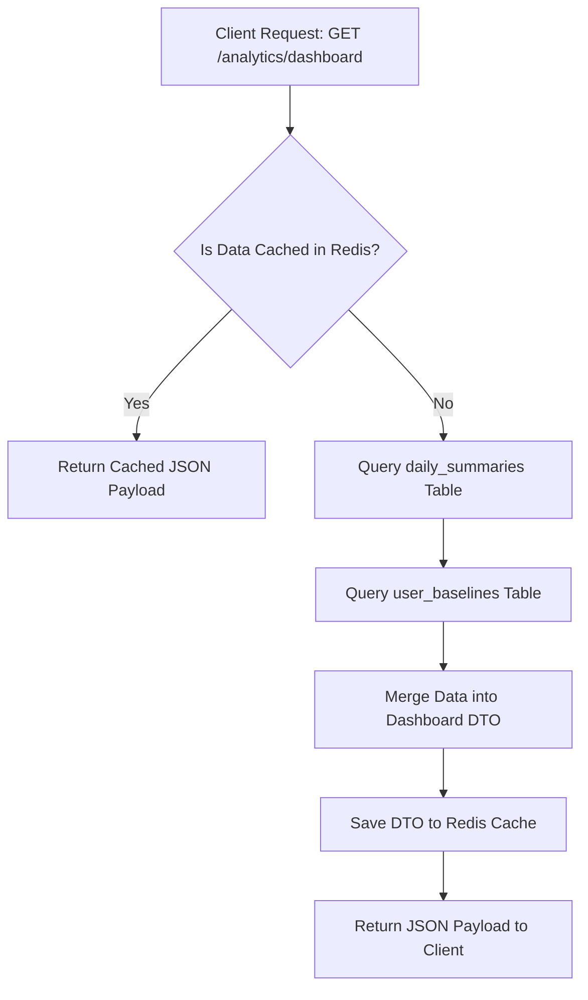

# MindGuard AI Analytics & Dashboard Engine Blueprint
## Enterprise Data Architecture, Dynamic Dashboard Layout, and Time-Series Analytics

This document details the production-ready architecture for the **Analytics & Dashboard Engine** (ADE) of MindGuard AI. The engine compiles time-series metrics from daily logs, the Digital Twin, and the Stress Likelihood Engine into pre-aggregated data models, rendering responsive dashboards on both Next.js and Android clients.

---

## 1. Analytics Architecture

The engine uses a pre-aggregated read path to avoid running heavy calculation queries on active transaction tables during dashboard loads.

```
       [lifestyle_logs] [mood_logs] [stress_estimations]
              │               │               │
              ▼               ▼               ▼
  ┌────────────────────────────────────────────────────────┐
  │ 1. Aggregation Pipeline                                │
  │    - Daily scheduled worker compiles raw log metrics   │
  └────────────────────────┬───────────────────────────────┘
                           │ Pre-Aggregated Buckets
                           ▼
  ┌────────────────────────────────────────────────────────┐
  │ 2. Analytics Database Layer                            │
  │    - Write to `daily_summaries` & `analytics_metrics`  │
  └────────────────────────┬───────────────────────────────┘
                           │ Time-Series Metrics
                           ▼
  ┌────────────────────────────────────────────────────────┐
  │ 3. Memory Caching Layer                                │
  │    - Redis stores chart-ready JSON arrays (1h expiry)  │
  └────────────────────────┬───────────────────────────────┘
                           │ Cache Hits
                           ▼
  ┌────────────────────────┴───────────────────────────────┐
  │ 4. REST API Endpoint Gateway                           │
  │    - FastAPI Routers output serialized DTO payloads    │
  └────────────────────────────────────────────────┘
```

---

## 2. Dashboard Architecture

To support fast load times ($<100$ms), the dashboard queries **pre-aggregated database views** and **Redis cache stores** rather than executing `JOIN` queries across transactional tables.



---

## 3. Analytics Modules

The engine includes several specialized analytics modules:
*   **Lifestyle Analytics:** Compares daily habits against baseline parameters to track routine stability.
*   **Mood Analytics:** Tracks mood trends and calculates emotional valence ratios (positive vs. negative entries).
*   **Sleep Analytics:** Tracks sleep duration trends, consistency scores, and wake time variations.
*   **Focus & Meditation Analytics:** Tracks focus block completion rates, distraction frequencies, and meditation streaks.
*   **Stress Analytics:** Tracks daily stress likelihood scores, risk level distributions, and the ratio of risk to protective factors.
*   **Habit Analytics:** Tracks progress against active goals and monitors habit recovery timelines.

---

## 4. Dashboard Layout

We define a responsive grid layout for the primary web and mobile dashboards:

```
  ┌─────────────────────────────────────────────────────────────────────────┐
  │                           COLLAPSIBLE SIDEBAR                           │
  ├─────────────────────────────────────────────────────────────────────────┤
  │ Header Row: Greeting & Daily Wellness Score Circular Ring               │
  ├─────────────────────────────────────────────────────────────────────────┤
  │ Row 1: KPI Cards Grid                                                   │
  │ [Stress Likelihood]  [Mood Index]  [Sleep Duration]  [Focus Minutes]     │
  ├─────────────────────────────────────────────────────────────────────────┤
  │ Row 2: Analytics & Twins Grid                                           │
  │ ┌──────────────────────────────────────┐ ┌────────────────────────────┐ │
  │ │ Recharts Spline: 7d Stress & Mood   │ │ Radar Chart: Digital Twin  │ │
  │ └──────────────────────────────────────┘ └────────────────────────────┘ │
  ├─────────────────────────────────────────────────────────────────────────┤
  │ Row 3: Detail Lists                                                     │
  │ ┌──────────────────────────────────────┐ ┌────────────────────────────┐ │
  │ │ Recent Insights / Alerts             │ │ Quick Action Panels        │ │
  │ └──────────────────────────────────────┘ └────────────────────────────┘ │
  └─────────────────────────────────────────────────────────────────────────┘
```

---

## 5. KPI Card Design

Key Performance Indicators (KPIs) display current metrics alongside trend indicators comparing today's values against weekly averages:
*   **Wellness Score (0-100):** Displayed using a circular progress ring.
*   **Stress Likelihood:** Displays the risk category (e.g. 'Elevated') with a trend indicator (e.g. *"+15% vs Last Week"*).
*   **Sleep Duration:** Displays total hours logged today (e.g., *7.2 hrs*) alongside consistency indicators.

---

## 6. Chart Strategy

We use **Recharts** on the web client and a custom canvas-based layout on Android. Charts are designed to automatically adapt to dark and light mode settings:

```
  Chart Type                 Target Metric                      Visual Mapping
  ┌─────────────────────────┬──────────────────────────────────┬─────────────────────────────────┐
  │ Area Chart (Spline)     │ 7-day Stress Likelihood Trend    │ Gradient fill (Teal to Blue)    │
  ├─────────────────────────┼──────────────────────────────────┼─────────────────────────────────┤
  │ Double Bar Chart        │ Observed Logs vs Twin Baseline   │ Side-by-side comparison bars    │
  ├─────────────────────────┼──────────────────────────────────┼─────────────────────────────────┤
  │ Radar Chart             │ Multi-habit Baseline Stability   │ Polygon overlaying habit axes   │
  ├─────────────────────────┼──────────────────────────────────┼─────────────────────────────────┤
  │ Heatmap                 │ Yearly Mood/Habit Consistency    │ Calendar grid with color alphas │
  └─────────────────────────┴──────────────────────────────────┴─────────────────────────────────┘
```

---

## 7. Trend Analysis Workflow

The Trend Engine calculates trend directions by fitting linear regressions over rolling timeframes (7 days, 30 days, 90 days):

$$y = m \cdot x + c$$

*   **$m$ (Slope):** Defines the trend direction.
    *   **$m > 0$:** Upward trend (e.g. increasing screen time).
    *   **$m < 0$:** Downward trend (e.g. decreasing sleep duration).
*   **$R^2$ (Correlation Coefficient):** Measures trend consistency. Values close to 1.0 indicate a stable trend.

---

## 8. Insight Generation Workflow

The Insight Engine translates statistical anomalies into natural-language summaries using pre-defined templates:
*   *Template 1 (Habit Shift):* *"Your sleep duration has drifted 1.2 hours lower than your normal routine over the past week."*
*   *Template 2 (Positive Habit):* *"Your weekly focus duration has remained consistently above your baseline."*

---

## 9. Goal Tracking Architecture

Goals are defined in the database and tracked against daily logs:
*   **Goal Mapping:** Maps metrics to target boundaries (e.g., Target: Sleep Duration $> 450$ minutes).
*   **Progress Evaluation:** Calculated by comparing daily logs against target thresholds.
*   **Goal Status:** Flagged as `active`, `completed`, or `failed` at the end of the day.

---

## 10. Achievement System

The Achievement System rewards consistent habits:
*   **Streaks:** Tracks consecutive days meeting active goals.
*   **Milestones:** Triggered when streaks reach specific targets (e.g. a 7-day meditation streak).
*   **Badges:** Earned by hitting milestones, saved to the `user_achievements` table and displayed in the user profile.

---

## 11. Predictive Analytics Architecture

The engine is designed to support future predictive models without database changes:
*   **ARIMA/LSTM Forecasting:** Supports loading time-series forecasting models to predict habit trends for the upcoming week.
*   **Risk Forecasting:** Uses trend directions to identify potential routine changes before they occur (e.g. predicting sleep debt accumulation).

---

## 12. Export System

Reports can be exported in PDF or CSV formats, processed asynchronously using background workers to prevent blocking the web server:

```
  [Request PDF Export] ──► [FastAPI Router] ──► [Enqueue Task (Celery)]
                                                      │
                                             Query historical DB
                                                      │
                                                      ▼
  [Client Download link] ◄── [Save to Storage] ◄── [Generate Report]
```

*   **CSV Exports:** Generates raw logs structured by date.
*   **PDF Reports:** Generates formatted summaries featuring habit charts, stress charts, and wellness scores.

---

## 13. Database Integration

The engine interacts with the following database tables:
*   `daily_summaries`: Caches aggregated daily statistics for dashboard loading.
*   `analytics_reports`: Stores metadata for generated PDF and CSV exports.
*   `analytics_metrics`: Stores time-series metrics optimized for graph generation.

---

## 14. FastAPI Integration

The Analytics Engine exposes the following REST API endpoints:
*   `GET /api/v1/analytics/dashboard`: Returns the user's dashboard data payload.
*   `GET /api/v1/analytics/trends?metric=sleep&days=30`: Returns historical data for the requested metric.
*   `POST /api/v1/analytics/export`: Enqueues a task to generate a PDF/CSV report.

---

## 15. Performance Optimization

1.  **Materialized Views:** Pre-calculates weekly and monthly averages, avoiding complex `GROUP BY` operations during requests.
2.  **Redis Cache Partitioning:** Dashboard JSON payloads are cached in Redis with an expiration of 1 hour. Submitting a new log invalidates the user's dashboard cache.
3.  **Graph Data Downsampling:** Historical charts spanning 3 months or more are downsampled (e.g. aggregating daily data into weekly averages) to keep payload sizes small.

---

## 16. Responsive Design Strategy

*   **Flexible Layouts:** The dashboard layout uses Tailwind's responsive grid system, adapting from a 3-column layout on desktop to a single-column layout on mobile.
*   **Chart Resizing:** Recharts wrapper components use `ResponsiveContainer` to automatically resize charts when the screen size changes.
*   **Mobile-Optimized Tooltips:** Hover tooltips are configured to trigger on tap gestures on mobile devices.

---

## 17. Future BI Expansion

The architecture is designed to support future Business Intelligence (BI) integrations:
*   **Data Warehouse Synchronization:** Supports exporting data to warehouses (such as Snowflake or Google BigQuery) for system-wide population analytics.
*   **BI Tool Integration:** Exposes read-only replica databases to connect BI reporting tools (e.g. Tableau, Looker) for administrative reporting.

---

## 18. Analytics Development Roadmap

```
  ┌────────────────────────────────────────────────────────┐
  │ Phase 1: Pre-aggregation schedulers & DB schemas       │
  └───────────────────────────┬────────────────────────────┘
                              │
                              ▼
  ┌────────────────────────────────────────────────────────┐
  │ Phase 2: Recharts templates & Android canvas charts    │
  └───────────────────────────┬────────────────────────────┘
                              │
                              ▼
  ┌────────────────────────────────────────────────────────┐
  │ Phase 3: Export pipelines & Celery worker integrations │
  └───────────────────────────┬────────────────────────────┘
                              │
                              ▼
  ┌────────────────────────────────────────────────────────┐
  │ Phase 4: Cache configurations & Performance testing    │
  └────────────────────────────────────────────────────────┘
```

1.  **Phase 1 (Foundations):** Build the daily pre-aggregation schemas, write schedulers to compile metrics, and verify index performance.
2.  **Phase 2 (Visuals):** Design dashboard widgets, configure Recharts graphs on the web client, and implement custom canvas charts on the Android client.
3.  **Phase 3 (Exports):** Set up Celery task queues for report generation and build PDF templates.
4.  **Phase 4 (Optimizations):** Configure Redis cache invalidation rules, run load tests, and optimize query performance.
