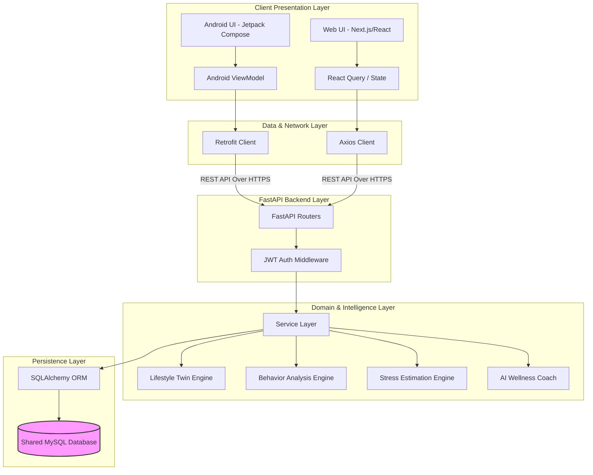
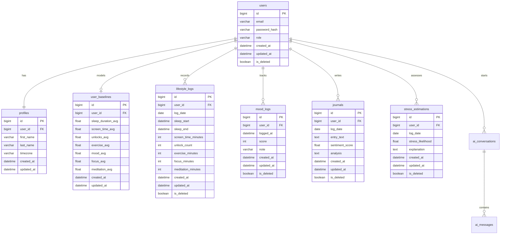
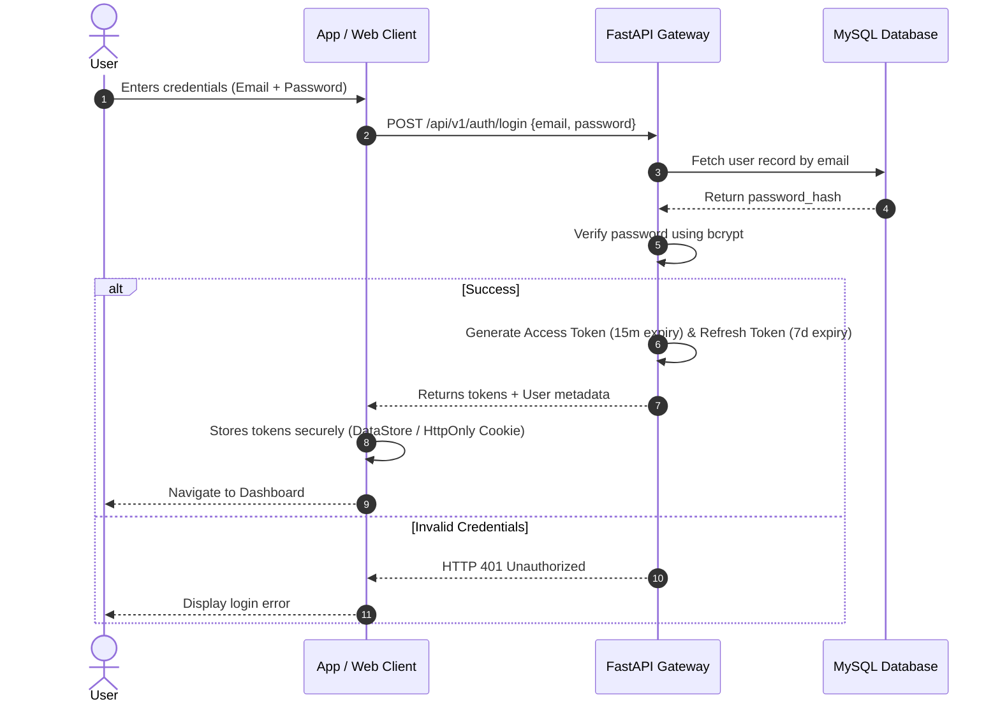
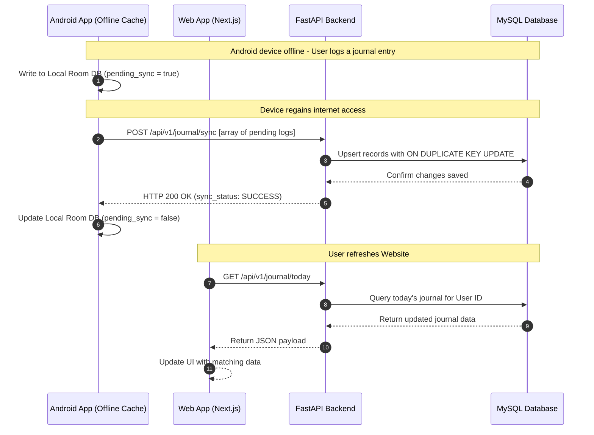
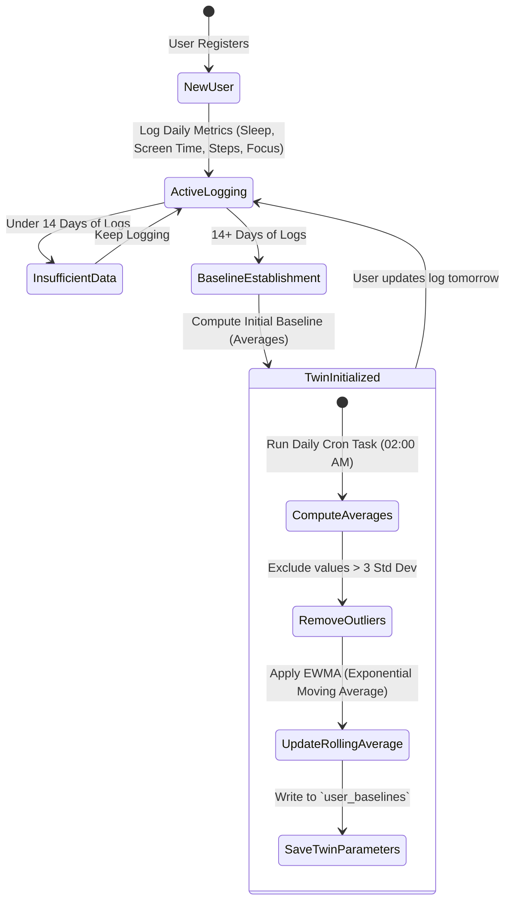
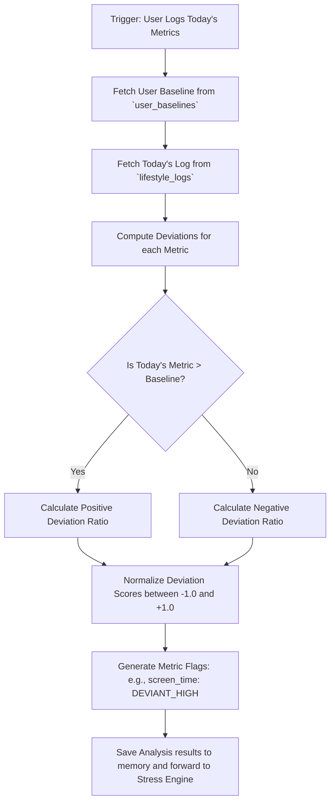
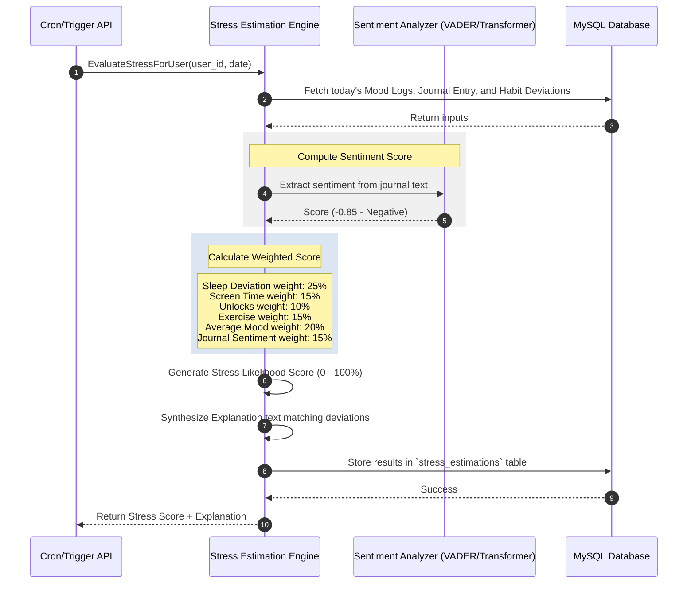
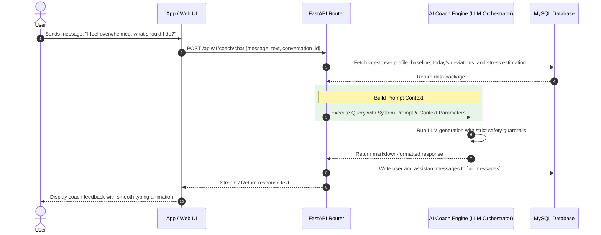

# MindGuard AI Architecture Blueprint
## "Your Digital Lifestyle Twin"

MindGuard AI is an enterprise-scale, production-ready AI SaaS platform designed to continuously learn a user's normal lifestyle patterns, detect behavioral deviations over time, estimate stress likelihood, and provide personalized AI-driven wellness coaching.

> [!IMPORTANT]
> **Core Architecture Guideline:** MindGuard AI is built on the principle of **intra-individual comparison**. The system compares a user's current behavioral state *only against their own historical baseline*, never against other users.
>
> **Medical Disclaimer:** The system does not diagnose mental illness or claim medical accuracy. All AI interactions and estimates are positioned as lifestyle insights.

---

## 1. Complete Project Overview

MindGuard AI provides a cross-platform experience (Android App + Next.js Website) backed by a unified backend and database. By continuously collecting passive metrics (screen time, unlocks, sleep) and active metrics (mood, journals, meditation, focus sessions), the platform forms a **Digital Lifestyle Twin** representing the user's normative baseline.

### Key Objectives
*   **Continuous Learning:** Establish and dynamically update a personalized lifestyle baseline.
*   **Behavioral Deviation Detection:** Identify when daily habits deviate significantly from baseline averages.
*   **Non-Diagnostic Stress Likelihood Estimation:** Correlate behavioral shifts, mood tracking, and journal sentiment to evaluate stress probability.
*   **Personalized AI Coaching:** Deliver contextual guidance based on deviations, mood, and sleep.
*   **Bi-directional Synchronization:** Ensure zero-latency data consistency across Android and Web clients.

---

## 2. Complete Software Architecture

The platform uses a layered, decoupled architecture with clear separation of concerns (Separation of Presentation, Domain, Data, and Core Business layers).



---

## 3. System Components

### 3.1 Android Client
*   **UI Framework:** Jetpack Compose for declarative, responsive UI components.
*   **Architecture Pattern:** Model-View-ViewModel (MVVM) matching Android Clean Architecture guidelines.
*   **Local Storage:** Room database acting strictly as an offline cache; DataStore for localized preferences and secure session tokens.
*   **Dependency Injection:** Hilt for modular, compile-time dependency management.
*   **Networking:** Retrofit for type-safe HTTP communication with coroutine support.

### 3.2 Next.js Web Client
*   **Framework:** Next.js 15 (App Router) using React 19 features.
*   **Styling & UI:** TailwindCSS paired with ShadCN UI (Radix UI primitives).
*   **State Management & Data Fetching:** React Query (TanStack Query) for API caching, pagination, and optimistic UI updates.
*   **Animations:** Framer Motion for premium micro-animations and layout transitions.

### 3.3 Python FastAPI Backend
*   **Web Framework:** FastAPI for high-performance, asynchronous REST endpoints.
*   **ORM:** SQLAlchemy 2.0 (asyncio extension) for type-safe database queries.
*   **Migrations:** Alembic for robust database schema versioning.
*   **Data Validation:** Pydantic v2 for runtime type validation and serialization.
*   **Authentication:** JWT tokens (Access + Refresh) using bcrypt for password hashing.

### 3.4 AI & Processing Engines
*   **Lifestyle Twin Engine:** Learns daily behavior, models the baseline, and updates it dynamically via rolling historical averages.
*   **Behavior Analysis Engine:** Performs statistical deviation modeling ($Z$-scoring) across daily lifestyle logs against the twin baseline.
*   **Stress Estimation Engine:** Evaluates multidimensional inputs to output a stress likelihood score with structured natural-language rationales.
*   **AI Coach Engine:** An LLM orchestrator that generates personalized, safe, and context-aware wellness feedback.

---

## 4. Technology Justification

| Technology | Domain | Core Benefit / Justification |
| :--- | :--- | :--- |
| **FastAPI** | Backend | Extremely high execution speed (comparable to Go/NodeJS), native asynchronous support (`async/await`), automatic OpenAPI docs generation, and integration with Python's AI/ML ecosystem. |
| **Next.js 15** | Web Frontend | Server-Side Rendering (SSR) and React Server Components (RSC) for performance, optimized SEO, routing simplicity, and compatibility with premium CSS libraries. |
| **Kotlin + Compose** | Android | Modern Android standard reducing UI boilerplate, facilitating smooth animations, and offering first-class MVVM compatibility. |
| **MySQL** | Database | ACID-compliant relational DB with support for complex joining queries (e.g., matching daily logs, journals, and mood trends), standard indexing, and cost-effective scaling on Render. |
| **React Query / Retrofit**| Sync Layer | Automatic caching, synchronization, retry logic, and request deduplication. Reduces unnecessary API calls while keeping client state aligned. |

---

## 5. Folder Structure

### 5.1 Android Client (`/android`)
```
android/
├── app/
│   └── src/
│       └── main/
│           └── java/com/mindguard/
│               ├── di/                   # Dependency Injection Modules (Hilt)
│               ├── data/                 # Data Layer
│               │   ├── local/            # Room DB, Entities, DAOs, DataStore
│               │   ├── remote/           # Retrofit API Interfaces, DTOs
│               │   └── repository/       # Repository Implementations
│               ├── domain/               # Domain Layer (Pure Kotlin)
│               │   ├── model/            # Business Models
│               │   ├── repository/       # Repository Interfaces
│               │   └── usecase/          # Specific Business Use Cases (e.g., GetStressScoreUseCase)
│               ├── presentation/         # Presentation Layer (Compose)
│               │   ├── ui/               # Theme, Styles, Global Componets
│               │   ├── auth/             # Login, Register Screens & ViewModels
│               │   ├── dashboard/        # Dashboard, Chart Componets, ViewModels
│               │   ├── journal/          # Journal Log Screen, ViewModels
│               │   └── twin/             # Lifestyle Twin View & AI Coach Chat Screen
│               └── MindGuardApp.kt       # Application class
```

### 5.2 FastAPI Backend (`/backend`)
```
backend/
├── app/
│   ├── api/
│   │   ├── v1/
│   │   │   ├── endpoints/                # Auth, Profile, Logs, AI Coach, Analytics
│   │   │   └── api.py                    # Router composition
│   │   └── deps.py                       # Common dependencies (DB session, Auth)
│   ├── core/
│   │   ├── config.py                     # Environment variables, Pydantic settings
│   │   ├── security.py                   # JWT creation, password hashing
│   │   └── database.py                   # SQLAlchemy connection session
│   ├── models/                           # SQLAlchemy Declarative Models
│   ├── schemas/                          # Pydantic Schemas for validation/serialization
│   ├── crud/                             # Create, Read, Update, Delete helpers
│   ├── services/                         # Core service functions
│   ├── engines/                          # AI Core (Lifestyle Twin, Stress Estimation, AI Coach)
│   └── main.py                           # FastAPI application initialization
├── migrations/                           # Alembic environment and files
├── alembic.ini
├── requirements.txt
└── Dockerfile
```

### 5.3 Next.js Website (`/website`)
```
website/
├── src/
│   ├── app/                              # Next.js 15 App Router
│   │   ├── layout.tsx                    # Root layout with React Query provider
│   │   ├── page.tsx                      # Landing / Login page
│   │   ├── dashboard/                    # Dashboard page
│   │   ├── journal/                      # Journal dashboard
│   │   └── coach/                        # AI Coach chat view
│   ├── components/
│   │   ├── ui/                           # ShadCN UI components (Button, Card, Dialog...)
│   │   ├── charts/                       # Recharts wrappers for data visualization
│   │   └── layout/                       # Navbar, Sidebar, Footer components
│   ├── hooks/                            # Custom React hooks (useAuth, useLifestyleLogs)
│   ├── services/                         # Axios client config and API calls
│   ├── store/                            # Client-side state managers (Zustand or context)
│   ├── types/                            # TypeScript interfaces
│   └── lib/                              # Utility classes (cn, tailwind-merge)
├── tailwind.config.ts
├── package.json
└── tsconfig.json
```

---

## 6. Clean Architecture Diagram

This data flow diagram illustrates how a user action on the client maps cleanly to the domain layers on both client and backend:

```
[Android Jetpack Compose]       [Website Tailwind/React]
           │                                │
           ▼                                ▼
[Android ViewModel (Hilt)]     [React Query / Custom Hooks]
           │                                │
           ▼                                ▼
[Domain Layer: Use Cases]                   │
           │                                │
           ▼                                ▼
[Repository Implementation]     [Axios API Service Client]
           │                                │
           └───────────────┬────────────────┘
                           │  HTTP / HTTPS REST Requests
                           ▼
             [FastAPI Endpoints / Routers]
                           │
                           ▼
             [Dependency Injection (deps.py)]
                           │
                           ▼
             [Domain Services & AI Engines]
                           │
             ┌─────────────┴─────────────┐
             ▼                           ▼
      [SQLAlchemy ORM]        [LLM / AI Coach Service]
             │
             ▼
      [(MySQL Database)]
```

---

## 7. Database Architecture

We implement a normalized MySQL schema built with standard auditing, soft deletion support, and structural indexes to optimize performance during temporal range searches (e.g., querying 30 days of lifestyle logs).



### Table Definitions & Indices

```sql
-- 1. Users Table
CREATE TABLE users (
    id BIGINT AUTO_INCREMENT PRIMARY KEY,
    email VARCHAR(255) NOT NULL UNIQUE,
    password_hash VARCHAR(255) NOT NULL,
    role VARCHAR(50) NOT NULL DEFAULT 'user',
    created_at DATETIME DEFAULT CURRENT_TIMESTAMP,
    updated_at DATETIME DEFAULT CURRENT_TIMESTAMP ON UPDATE CURRENT_TIMESTAMP,
    is_deleted BOOLEAN DEFAULT FALSE,
    INDEX idx_users_email (email),
    INDEX idx_users_is_deleted (is_deleted)
) ENGINE=InnoDB DEFAULT CHARSET=utf8mb4 COLLATE=utf8mb4_unicode_ci;

-- 2. Profiles Table
CREATE TABLE profiles (
    id BIGINT AUTO_INCREMENT PRIMARY KEY,
    user_id BIGINT NOT NULL UNIQUE,
    first_name VARCHAR(100),
    last_name VARCHAR(100),
    timezone VARCHAR(100) DEFAULT 'UTC',
    created_at DATETIME DEFAULT CURRENT_TIMESTAMP,
    updated_at DATETIME DEFAULT CURRENT_TIMESTAMP ON UPDATE CURRENT_TIMESTAMP,
    FOREIGN KEY (user_id) REFERENCES users(id) ON DELETE CASCADE
) ENGINE=InnoDB DEFAULT CHARSET=utf8mb4 COLLATE=utf8mb4_unicode_ci;

-- 3. User Baselines (Digital Twin Base Parameters)
CREATE TABLE user_baselines (
    id BIGINT AUTO_INCREMENT PRIMARY KEY,
    user_id BIGINT NOT NULL UNIQUE,
    sleep_duration_avg FLOAT DEFAULT 480.0, -- In minutes
    screen_time_avg FLOAT DEFAULT 240.0,    -- In minutes
    unlocks_avg FLOAT DEFAULT 60.0,
    exercise_avg FLOAT DEFAULT 30.0,        -- In minutes
    mood_avg FLOAT DEFAULT 3.5,             -- Scale of 1 to 5
    focus_avg FLOAT DEFAULT 60.0,           -- In minutes
    meditation_avg FLOAT DEFAULT 15.0,      -- In minutes
    created_at DATETIME DEFAULT CURRENT_TIMESTAMP,
    updated_at DATETIME DEFAULT CURRENT_TIMESTAMP ON UPDATE CURRENT_TIMESTAMP,
    FOREIGN KEY (user_id) REFERENCES users(id) ON DELETE CASCADE
) ENGINE=InnoDB DEFAULT CHARSET=utf8mb4 COLLATE=utf8mb4_unicode_ci;

-- 4. Daily Lifestyle Logs
CREATE TABLE lifestyle_logs (
    id BIGINT AUTO_INCREMENT PRIMARY KEY,
    user_id BIGINT NOT NULL,
    log_date DATE NOT NULL,
    sleep_start DATETIME,
    sleep_end DATETIME,
    screen_time_minutes INT DEFAULT 0,
    unlock_count INT DEFAULT 0,
    exercise_minutes INT DEFAULT 0,
    focus_minutes INT DEFAULT 0,
    meditation_minutes INT DEFAULT 0,
    created_at DATETIME DEFAULT CURRENT_TIMESTAMP,
    updated_at DATETIME DEFAULT CURRENT_TIMESTAMP ON UPDATE CURRENT_TIMESTAMP,
    is_deleted BOOLEAN DEFAULT FALSE,
    UNIQUE KEY uq_user_date (user_id, log_date),
    FOREIGN KEY (user_id) REFERENCES users(id) ON DELETE CASCADE,
    INDEX idx_lifestyle_user_date (user_id, log_date),
    INDEX idx_lifestyle_deleted (is_deleted)
) ENGINE=InnoDB DEFAULT CHARSET=utf8mb4 COLLATE=utf8mb4_unicode_ci;

-- 5. Mood Logs (Allows multiple checks per day)
CREATE TABLE mood_logs (
    id BIGINT AUTO_INCREMENT PRIMARY KEY,
    user_id BIGINT NOT NULL,
    logged_at DATETIME NOT NULL,
    score INT NOT NULL, -- Scale of 1 (Worst) to 5 (Best)
    note VARCHAR(255),
    created_at DATETIME DEFAULT CURRENT_TIMESTAMP,
    updated_at DATETIME DEFAULT CURRENT_TIMESTAMP ON UPDATE CURRENT_TIMESTAMP,
    is_deleted BOOLEAN DEFAULT FALSE,
    FOREIGN KEY (user_id) REFERENCES users(id) ON DELETE CASCADE,
    INDEX idx_mood_user_time (user_id, logged_at),
    INDEX idx_mood_deleted (is_deleted)
) ENGINE=InnoDB DEFAULT CHARSET=utf8mb4 COLLATE=utf8mb4_unicode_ci;

-- 6. Journal Entries
CREATE TABLE journals (
    id BIGINT AUTO_INCREMENT PRIMARY KEY,
    user_id BIGINT NOT NULL,
    log_date DATE NOT NULL,
    entry_text TEXT NOT NULL,
    sentiment_score FLOAT DEFAULT 0.0, -- Range: -1.0 (Very Negative) to 1.0 (Very Positive)
    analysis TEXT,                     -- Extracted entities, core theme tags
    created_at DATETIME DEFAULT CURRENT_TIMESTAMP,
    updated_at DATETIME DEFAULT CURRENT_TIMESTAMP ON UPDATE CURRENT_TIMESTAMP,
    is_deleted BOOLEAN DEFAULT FALSE,
    UNIQUE KEY uq_journal_user_date (user_id, log_date),
    FOREIGN KEY (user_id) REFERENCES users(id) ON DELETE CASCADE,
    INDEX idx_journal_user_date (user_id, log_date),
    INDEX idx_journal_deleted (is_deleted)
) ENGINE=InnoDB DEFAULT CHARSET=utf8mb4 COLLATE=utf8mb4_unicode_ci;

-- 7. Stress Estimations
CREATE TABLE stress_estimations (
    id BIGINT AUTO_INCREMENT PRIMARY KEY,
    user_id BIGINT NOT NULL,
    log_date DATE NOT NULL,
    stress_likelihood FLOAT NOT NULL,  -- Percentage or Likelihood value (0.0 to 100.0)
    explanation TEXT NOT NULL,
    created_at DATETIME DEFAULT CURRENT_TIMESTAMP,
    updated_at DATETIME DEFAULT CURRENT_TIMESTAMP ON UPDATE CURRENT_TIMESTAMP,
    is_deleted BOOLEAN DEFAULT FALSE,
    UNIQUE KEY uq_stress_user_date (user_id, log_date),
    FOREIGN KEY (user_id) REFERENCES users(id) ON DELETE CASCADE,
    INDEX idx_stress_user_date (user_id, log_date),
    INDEX idx_stress_deleted (is_deleted)
) ENGINE=InnoDB DEFAULT CHARSET=utf8mb4 COLLATE=utf8mb4_unicode_ci;

-- 8. AI Conversations (Parent for Chat History)
CREATE TABLE ai_conversations (
    id BIGINT AUTO_INCREMENT PRIMARY KEY,
    user_id BIGINT NOT NULL,
    title VARCHAR(255) DEFAULT 'New Conversation',
    created_at DATETIME DEFAULT CURRENT_TIMESTAMP,
    updated_at DATETIME DEFAULT CURRENT_TIMESTAMP ON UPDATE CURRENT_TIMESTAMP,
    is_deleted BOOLEAN DEFAULT FALSE,
    FOREIGN KEY (user_id) REFERENCES users(id) ON DELETE CASCADE,
    INDEX idx_ai_conv_user (user_id),
    INDEX idx_ai_conv_deleted (is_deleted)
) ENGINE=InnoDB DEFAULT CHARSET=utf8mb4 COLLATE=utf8mb4_unicode_ci;

-- 9. AI Messages
CREATE TABLE ai_messages (
    id BIGINT AUTO_INCREMENT PRIMARY KEY,
    conversation_id BIGINT NOT NULL,
    sender VARCHAR(50) NOT NULL, -- 'user' or 'coach'
    message_text TEXT NOT NULL,
    created_at DATETIME DEFAULT CURRENT_TIMESTAMP,
    FOREIGN KEY (conversation_id) REFERENCES ai_conversations(id) ON DELETE CASCADE,
    INDEX idx_msg_conversation (conversation_id)
) ENGINE=InnoDB DEFAULT CHARSET=utf8mb4 COLLATE=utf8mb4_unicode_ci;
```

---

## 8. Authentication Workflow

MindGuard AI secures API communication using an industry-standard OAuth2 JWT workflow featuring short-lived access tokens and refresh tokens. This guarantees that whether a user logs in on their phone or on the website, they instantly connect to the same profile.



### Token Expiration and Refresh Workflow
*   **Access Token:** Sent via the `Authorization: Bearer <token>` header, expires in 15 minutes.
*   **Refresh Token:** Used to obtain a new access token when it expires. Sent to `/api/v1/auth/refresh`. Securely rotated to prevent replay attacks.

---

## 9. Synchronization Workflow

A critical project requirement is that the Android App and Website display identical, synchronized user information. The architecture prevents race conditions and conflict resolution issues through a single-source-of-truth strategy.



### Core Synchronization Rules:
1.  **Single Source of Truth:** The central MySQL database is the absolute source of truth.
2.  **Date-Based Upserts:** Daily lifestyle metric logs have a unique key constraint `(user_id, log_date)`. Submissions from any device overwrite or merge into this day's record using database `UPSERT` operators.
3.  **Audit Column Checks:** The client queries `/api/v1/sync/status` with their latest local timestamp. The backend checks `updated_at` records and responds only with resources modified after that timestamp, minimizing bandwidth.

---

## 10. Digital Lifestyle Twin Workflow

The **Digital Lifestyle Twin** represents the user's learned normal behavioral patterns. The engine builds and refreshes the baseline using a moving target model.



### Mathematical Formula for Baseline Updating:
To ensure the baseline adapts slowly to long-term lifestyle changes (e.g., starting a new job) but isn't instantly warped by single-day extremes, we implement an **Exponentially Weighted Moving Average (EWMA)**:

$$\mu_{new} = \alpha \cdot X_{today} + (1 - \alpha) \cdot \mu_{previous}$$

*   **$X_{today}$**: The user's behavior metric today.
*   **$\mu$**: The Digital Twin's baseline average.
*   **$\alpha$ (Smoothing Factor):** Fixed at `0.07`, meaning baseline changes require ~14 days of sustained habits to fully register.

---

## 11. Behavior Analysis Workflow

This engine acts as a pipeline that takes today's data, compares it against the Digital Twin's baseline, and detects statistical deviations.



### Normalization Logic:
For a metric like Screen Time ($S$):
$$S_{dev} = \frac{S_{today} - S_{baseline}}{S_{baseline}}$$

*   If $S_{dev} > 1.5$ (50% increase), the engine flags a significant habit deviation.
*   If $S_{today}$ was 9 hours and $S_{baseline}$ is 4 hours: $S_{dev} = \frac{9 - 4}{4} = +1.25$ (125% increase).

---

## 12. Stress Estimation Workflow

The **Stress Estimation Engine** takes the output of the Behavior Analysis Engine, matches it with active indicators (Mood logs, Journal Sentiment), and calculates a likelihood score. It generates a detailed description of *why* the score has changed.



### Example Stress Likelihood Math:
*   **Sleep deficit:** $2$ hours less than baseline ($+15\%$ stress)
*   **Screen time:** $+125\%$ increase ($+15\%$ stress)
*   **Mood:** $2.0$ average vs $3.8$ baseline ($+20\%$ stress)
*   **Journal Sentiment:** Negative ($+15\%$ stress)
*   **Exercise:** None ($0$ minutes vs $30$ minutes baseline) ($+15\%$ stress)
*   **Total Calculated Stress Likelihood:** $80\%$
*   **Synthesized Explanation:** *"Stress likelihood is high today. Your sleep was 2 hours shorter than your normal baseline, screen time increased by 125%, exercise dropped to zero, and your journals reflected a highly stressed emotional state."*

---

## 13. AI Coach Workflow

The **AI Coach** is not responsible for calculating stress. It consumes the output of the database state, the baseline, and the stress estimations to deliver structured, safe, and conversational guidance.



### Safety and Context System Prompt (Template):
```
You are the MindGuard AI Digital Lifestyle Coach.
Your user is chatting with you. You have access to their Digital Twin baseline and today's deviations:
- User Baseline: Sleep = 8h, Screen Time = 4h, Meditation = 15m
- Today's State: Sleep = 5.5h, Screen Time = 7.5h, Meditation = 0m
- Current Stress Estimation Likelihood: 72% (Elevated due to sleep loss and high screen time)

Your role is to offer supportive wellness tips, study routines, and healthy advice. 

CRITICAL SAFETY INSTRUCTION:
Do not diagnose any medical or psychological condition. Do not claim medical authority. If the user expresses self-harm or deep depressive symptoms, respond with a compassionate message and output resource helplines. Keep the tone warm, practical, and tailored to their specific habit shifts.
```

---

## 14. Deployment Architecture

MindGuard AI is deployed using modern cloud platforms that support automatic scaling and SSL certificates.

```
       [Users: Web Client]              [Users: Android App]
                │                                │
                ▼                                ▼
       [Vercel Edge Network]                     │
       ┌───────────────────┐                     │
       │ Next.js Frontend  │                     │
       │ Static & SSR Pages│                     │
       └────────┬──────────┘                     │
                │                                │
                │ HTTPS (API Requests)           │ HTTPS (API Requests)
                └───────────────┬────────────────┘
                                │
                                ▼
                       [Render Cloud Platform]
                       ┌───────────────────────┐
                       │ FastAPI Backend App   │
                       │ - Dockerized Container│
                       │ - Auto-Scaling Groups │
                       └───────────┬───────────┘
                                   │
                                   │ Private Network Connection
                                   ▼
                       [Render Managed Database]
                       ┌───────────────────────┐
                       │ MySQL Database Cluster│
                       │ - Encrypted at Rest   │
                       │ - Auto-backups        │
                       └───────────────────────┘
```

### Environment Configurations
*   **Vercel Production Variables:**
    *   `NEXT_PUBLIC_API_URL`: Points to the Render backend HTTPS domain (e.g. `https://api.mindguard.ai`).
*   **Render Backend Variables:**
    *   `DATABASE_URL`: `mysql+aiomysql://<user>:<pass>@<host>:<port>/mindguard` (SSL mode enforced).
    *   `JWT_SECRET`: Cryptographically strong random string.
    *   `LLM_API_KEY`: API access key for AI Coach completions.
    *   `CORS_ORIGINS`: `["https://mindguard.ai", "https://mindguard-web.vercel.app"]` (restricted to frontend to block cross-site scripting).

---

## 15. Development Roadmap

Our implementation follows a modular path ensuring core system modules are solid before building the AI capabilities on top.

```
   ┌────────────────────────────────────────────────────────┐
   │ Phase 1: Database Setup & JWT Authentication           │
   └───────────────────────────┬────────────────────────────┘
                               │
                               ▼
   ┌────────────────────────────────────────────────────────┐
   │ Phase 2: Lifestyle Logging & Synchronization APIs      │
   └───────────────────────────┬────────────────────────────┘
                               │
                               ▼
   ┌────────────────────────────────────────────────────────┐
   │ Phase 3: Android App & Website Core UI Development     │
   └───────────────────────────┬────────────────────────────┘
                               │
                               ▼
   ┌────────────────────────────────────────────────────────┐
   │ Phase 4: Digital Lifestyle Twin & Behavior Engines     │
   └───────────────────────────┬────────────────────────────┘
                               │
                               ▼
   ┌────────────────────────────────────────────────────────┐
   │ Phase 5: AI Coach & Stress Estimation Launch           │
   └───────────────────────────┬────────────────────────────┘
                               │
                               ▼
   ┌────────────────────────────────────────────────────────┐
   │ Phase 6: Cloud Deployment & System Verification        │
   └────────────────────────────────────────────────────────┘
```

---

## 16. Implementation Phases

### Phase 1: Foundation (Backend & DB Setup)
*   Deploy local MySQL Docker container.
*   Setup FastAPI starter template, configure SQLAlchemy with Alembic, and perform initial migration.
*   Implement `/api/v1/auth/register`, `/login`, and `/refresh` endpoints. Write unit tests for JWT validation.

### Phase 2: Sync Layer (Logging Endpoints)
*   Create endpoints for reading/writing `lifestyle_logs`, `mood_logs`, and `journals`.
*   Develop the bulk synchronization API `/api/v1/sync/bulk` with conflict-resolution parameters.

### Phase 3: Frontend Foundations (Android & Web)
*   **Android:** Setup Hilt, Retrofit, Room DB, Navigation Compose, and construct Login/Register Compose layouts.
*   **Website:** Initialize Next.js 15 app, set up Tailwind and ShadCN, build Axios client, and configure React Query wrappers.

### Phase 4: Twin & Analysis Engines
*   Write mathematical models for baseline establishment ($EWMA$) and deviation detection ($Z$-scoring).
*   Create a background runner in FastAPI (running daily) that updates all active user baselines.

### Phase 5: Stress Estimation & AI Coach
*   Implement stress scoring formula incorporating journal sentiment and deviations.
*   Configure the LLM client provider (FastAPI endpoint `/api/v1/coach/chat`) passing the structured system context and verifying strict non-medical guidelines.

### Phase 6: Deployment & Launch
*   Deploy database and backend application to Render.
*   Deploy frontend application to Vercel.
*   Verify cross-platform state synchronization, end-to-end encryption, and response latencies.

---

## 17. Future Scalability Plan

To ensure the platform is ready for rapid growth, the architecture is designed with the following scalability options:

1.  **Database Read Replication:** Create MySQL read replicas to handle dashboard read traffic, while reserving the primary database instance for write transactions (logs, sync sessions).
2.  **Asynchronous Job Processing:** Offload heavy computational processes (such as updating baselines and computing LLM sentiment indices) to background task queues using **Celery** or **Huey** backed by **Redis** as a broker.
3.  **WebSocket Integration:** Upgrade the AI Coach chat endpoint to use WebSockets for message streaming instead of polling, improving communication speed.
4.  **Local Encryption (On Android):** Utilize SQLCipher for the local Android Room database cache to secure cached journals and metrics offline.
