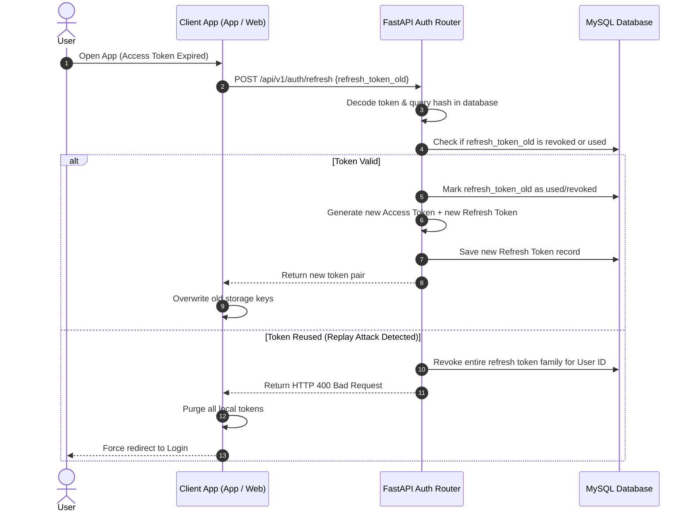
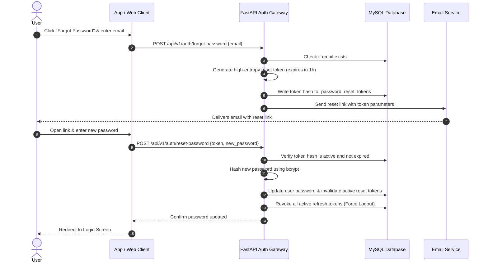

# MindGuard AI Auth & Sync Architecture Blueprint
## Enterprise Identity, Access Management, and Data Synchronization Design

This document details the production-ready identity, access management, and bi-directional data synchronization architecture for MindGuard AI. The system enforces a **single identity** across all current and future client applications (Android, Web, iOS, Desktop) connected to a unified FastAPI gateway and MySQL backend.

---

## 1. Authentication Architecture

MindGuard AI uses a centralized Identity Provider (IdP) model implemented directly within the FastAPI backend. 

```
  ┌─────────────────┐       ┌───────────────┐
  │  Android App    ├──────►│               │
  └─────────────────┘       │               │
  ┌─────────────────┐       │    FastAPI    │       ┌────────────────┐
  │  Web Next.js    ├──────►│  Auth Gateway ├──────►│ MySQL Database │
  └─────────────────┘       │               │       └────────────────┘
  ┌─────────────────┐       │               │
  │ iOS/Desktop App ├──────►│               │
  └─────────────────┘       └───────────────┘
```

### Core Architecture Components:
1.  **Unified User Directory:** All credentials, roles, and profiles reside in a single MySQL instance.
2.  **Stateless Session Validation:** Clients communicate using OAuth2-compatible JSON Web Tokens (JWT).
3.  **Client Agnostic Gateway:** The backend processes login requests, returns tokens, and exposes verified user contexts regardless of whether the request originates from a phone, browser, or server.

---

## 2. Authorization Architecture

MindGuard AI implements **Claims-Based Role-Based Access Control (RBAC)**.
*   **Token Verification Middleware:** FastAPI intercepts incoming HTTP requests, decodes the signature of the Bearer access token, and checks for revocation.
*   **Context Injection:** Upon signature validation, user identity claims (user ID, role, and specific permissions) are injected into the request state, providing controllers with immediate context.
*   **Scope Checks:** Custom route dependencies verify that the authenticated user possesses the specific permission required to execute the action (e.g., `@require_permission("view:audit_logs")`).

---

## 3. JWT Flow

Our JWT implementation divides duties between two tokens to ensure security:

```
┌────────────────────────────────────────────────────────────────────────┐
│                          Access Token Claims                           │
├───────────────┬────────────────────────────────────────────────────────┤
│ sub           │ Unique Database User ID (integer)                      │
│ role          │ User Role String (e.g., 'user', 'admin')               │
│ permissions   │ Array of string privileges (e.g., ['write:journal'])  │
│ exp           │ UTC Expiry Timestamp (15-minute lifetime)              │
│ jti           │ Unique Cryptographic ID for token tracking             │
│ is_verified   │ Email verification status boolean                      │
└───────────────┴────────────────────────────────────────────────────────┘
```

*   **Signature Algorithm:** HMAC SHA-256 (`HS256`) using a 256-bit cryptographically random secret key.
*   **Lifetime:** 15 minutes. This minimizes the risk of token theft without putting excessive load on the refresh server.

---

## 4. Refresh Token Flow & Rotation

To prevent unauthorized sessions, we implement **Refresh Token Rotation (RTR)**.



### Refresh Token Security Rules:
1.  **Unique Families:** Refresh tokens are chained in families. Using a token invalidates it and issues a successor.
2.  **Replay Detection:** If a previously used refresh token is submitted, the backend flags a replay attack, immediately invalidating the entire token family. The user is logged out of all active devices.
3.  **Blacklist Store:** Revoked refresh tokens are stored in the database (and cached in Redis) until their original expiry date passes.

---

## 5. Session Management Design

We track active login sessions across devices in the `user_sessions` table, mapping credentials to physical devices:

*   **Session Initialization:** Successful login writes a session record containing:
    *   `device_id`: Device identifier.
    *   `ip_address`: Public IP address.
    *   `user_agent`: Browser and OS version.
    *   `last_active_at`: Updated on every authenticated API call.
*   **Activity Window:** Session records are marked inactive if `last_active_at` exceeds the configured inactivity limit (e.g., 30 days).

---

## 6. Device Management Design

```
                     [User Preferences Screen]
                                 │
         ┌───────────────────────┼───────────────────────┐
         ▼                       ▼                       ▼
┌─────────────────┐     ┌─────────────────┐     ┌─────────────────┐
│  List Devices   │     │  Rename Device  │     │ Revoke Session  │
│ GET /devices    │     │ PATCH /devices  │     │ DELETE /devices │
└─────────────────┘     └─────────────────┘     └─────────────────┘
```

1.  **View Devices (`GET /api/v1/devices`):** Returns a list of active sessions associated with the user's account, showing device name, platform, last active time, and approximate location.
2.  **Revoke Specific Session (`DELETE /api/v1/devices/{session_id}`):** Deletes the selected session record and immediately revokes the associated refresh token, forcing the target device to log out.
3.  **Revoke All Sessions (`POST /api/v1/devices/revoke-all`):** Invalidates all sessions and refresh tokens except for the session currently making the request.

---

## 7. Email Verification Flow

1.  **Registration Hook:** Creating an account sets the user status to `is_active = TRUE` and `is_verified = FALSE`. The system generates a high-entropy validation token, saves it to `otp_verifications`, and sends it to the user's email.
2.  **Restricted State:** Unverified accounts are permitted to authenticate, but middleware blocks access to core APIs (e.g., logs, journal, twin, AI coach) with an `HTTP 403 Forbidden` response: `"Email address verification required"`.
3.  **Verification Resolution:** The user submits the validation token to `/api/v1/auth/verify`. Upon validation, the token is marked as verified, and the user status is updated to `is_verified = TRUE`.
4.  **Expiry & Renewal:** Verification tokens expire after 24 hours. Users can request a new token using the `/api/v1/auth/resend-verification` endpoint.

---

## 8. Password Reset Flow



---

## 9. Role-Based Access Control (RBAC) Design

Permissions are explicitly declared strings grouped by user roles.

```
       [Super Admin] ──► Inherits Admin Permissions + manage_system
            │
            ▼
         [Admin]      ──► Inherits User Permissions + view_audit_logs
            │
            ▼
         [User]       ──► Read/Write personal logs and profile data
```

### Roles and Associated Permissions:
*   **`user`:** `['read:dashboard', 'write:logs', 'read:logs', 'write:journal', 'read:journal', 'chat:coach', 'manage:preferences']`
*   **`admin`:** Inherits `user` permissions, plus: `['read:admin_dashboard', 'read:users', 'suspend:users', 'read:audit_logs', 'read:analytics', 'manage:feature_flags']`
*   **`superadmin`:** Inherits all permissions, plus: `['delete:users', 'write:settings', 'manage:admins']`

---

## 10. Synchronization Workflow

To ensure data consistency across devices, we use an event-driven synchronization workflow.

```
 [Android Event: Update Profile]        [Web Client: Subscribed]
                │                                  ▲
                ▼                                  │
    [FastAPI Endpoint: PUT]                        │
                │                                  │
                ├─► Write to Database (MySQL)      │
                │                                  │
                └─► Publish Event ─────────────────┘
                    (FCM Push / WebSockets)
```

1.  **Data Ingestion:** When a client updates profile properties, preferences, or logs, the update is sent to the FastAPI backend.
2.  **Database Commit:** The backend updates the record in the central MySQL database, updating the `updated_at` column.
3.  **Real-Time Dispatch:** The backend triggers an asynchronous task to dispatch the update event.
    *   **To Web Clients:** Published over active WebSockets or Server-Sent Events (SSE).
    *   **To Android Clients:** Dispatched via Firebase Cloud Messaging (FCM) data payloads, instructing the client to fetch the updated resource in the background.

---

## 11. Offline Sync Strategy (Android Client)

To support offline use on the Android client, we implement a synchronization queue using the local Room database.

```
  ┌────────────────────────────────────────────────────────┐
  │ 1. Android Offline Action: User logs water intake      │
  └───────────────────────────┬────────────────────────────┘
                              │
                              ▼
  ┌────────────────────────────────────────────────────────┐
  │ 2. Room DB Insertion: Write record with fields:        │
  │    - sync_status = 'pending_insert'                    │
  │    - last_modified_at = current local timestamp        │
  └───────────────────────────┬────────────────────────────┘
                              │
                              ▼
  ┌────────────────────────────────────────────────────────┐
  │ 3. Connection Restoration: Network returns; trigger    │
  │    WorkManager synchronization loop                    │
  └───────────────────────────┬────────────────────────────┘
                              │
                              ▼
  ┌────────────────────────────────────────────────────────┐
  │ 4. Batch Submission: Send pending updates to backend   │
  │    POST /api/v1/sync/bulk                              │
  └───────────────────────────┬────────────────────────────┘
                              │
                              ▼
  ┌────────────────────────────────────────────────────────┐
  │ 5. Response Reconciliation: Backend confirms save.     │
  │    Update Room DB status:                              │
  │    - sync_status = 'synced'                            │
  └────────────────────────────────────────────────────────┘
```

### Sync Engine Rules:
*   **Exponential Backoff:** If the sync request fails due to network issues, the request is retried using exponential backoff (e.g. 30s, 60s, 300s).
*   **Payload Batching:** Changes are queued locally and sent in a single batch to the `/api/v1/sync/bulk` endpoint, reducing network overhead.

---

## 12. Conflict Resolution Strategy

When a user edits resources on multiple devices simultaneously, the backend resolves conflicts using an **Optimistic Locking** approach.

### Table Schema Support:
All synchronized tables include a `version` column:
*   `version`: `INT UNSIGNED DEFAULT 1` [NOT NULL]

### Conflict Detection & Resolution Flow:
1.  **Submit Request:** The client includes the resource ID, payload, and the local `version` number (e.g., `version = 4`) in its update request.
2.  **Backend Verification:** The backend reads the current database record.
    *   **No Conflict:** If the database record matches the client's version (`version = 4`), the update is applied, the version number is incremented (`version = 5`), and the update succeeds.
    *   **Conflict Detected:** If the database version is higher (e.g., `version = 5`, updated by another device), the backend rejects the request with an `HTTP 409 Conflict` status, returning the current database payload.
3.  **Client Resolution:** The client receives the current database payload and resolves the conflict.
    *   **Last-Write-Wins (LWW):** For non-critical fields (e.g., theme preferences, screen time aggregates), the client automatically overwrites local changes with the database state.
    *   **Merge Resolution:** For journal entries or notes, the client merges the text blocks or prompts the user to select which version to keep.

---

## 13. Security Best Practices

*   **bcrypt Configurations:** Passwords are hashed using `bcrypt` configured with 12 work factors to protect against brute-force attacks.
*   **HTTPS Enforcement:** All API traffic is routed over HTTPS. The FastAPI backend redirects HTTP requests to HTTPS and includes HSTS (`Strict-Transport-Security`) headers in responses.
*   **Rate Limiting Policies:** Rate limiting is enforced at the API gateway layer using IP and API key identifiers:
    *   `POST /api/v1/auth/login`: Maximum of 5 requests per minute.
    *   `POST /api/v1/auth/reset-password`: Maximum of 3 requests per hour.
    *   Standard APIs: Maximum of 100 requests per minute.
*   **Brute Force Protection:** Accounts are locked for 15 minutes after 5 consecutive failed login attempts within a 10-minute window.

---

## 14. API Security Guidelines

1.  **Input Validation:** Pydantic schemas validate all incoming requests, rejecting payloads that fail validation (e.g. invalid email formats, malformed JSON).
2.  **Output Serialization:** Response schemas explicitly define allowed return fields, ensuring internal keys, hashes, and audit parameters are stripped before the response is returned to the client.
3.  **Strict Context Boundaries:** Database queries verify that requested resources belong to the authenticated user:
    *   `SELECT * FROM journals WHERE id = :journal_id AND user_id = :authenticated_user_id`

---

## 15. Audit Logging Strategy

Audit logs are structured records of administrative and security events, written to a dedicated, read-only audit log table.

```json
{
  "timestamp": "2026-07-22T14:22:05.102Z",
  "actor_id": 841,
  "action": "password_changed",
  "ip_address": "198.51.100.42",
  "user_agent": "Mozilla/5.0 (Android; Mobile; rv:128.0)",
  "status": "success",
  "payload": { "session_invalidations": 4 }
}
```

*   **Immutable Storage:** The `audit_logs` table only permits `INSERT` actions. Database triggers reject `UPDATE` or `DELETE` requests to ensure log integrity.
*   **Monitored Events:** The system logs logins, failed logins, password changes, MFA activations, and profile updates.

---

## 16. Deployment Considerations for Render

When deploying the authentication and synchronization systems to Render, the following settings must be configured:

1.  **CORS Allowed Origins:** Configure the backend `CORS_ORIGINS` environment variable to explicitly allow the Vercel frontend URL:
    *   `CORS_ORIGINS=["https://mindguard.vercel.app", "https://api.mindguard.render.com"]`
2.  **Cookie Secure Flag:** Set the access token cookie flags to `Secure`, `HttpOnly`, and `SameSite=Strict`.
3.  **Private Database Network:** Run the FastAPI backend and MySQL instance within a Render private network. This ensures database traffic is not exposed to the public internet.

---

## 17. Future Third-Party OAuth Expansion Plan

The authentication system is designed to support OAuth2 social login (Google, Microsoft, Apple) in the future without database redesign:

```
                  ┌──────────────────────────────┐
                  │         users Table          │
                  └──────────────┬───────────────┘
                                 │ 1:Many
                                 ▼
                  ┌──────────────────────────────┐
                  │    user_social_accounts      │
                  └──────────────────────────────┘
```

### OAuth Extension Table: `user_social_accounts`
*   `id`: `BIGINT UNSIGNED AUTO_INCREMENT` [PK]
*   `user_id`: `BIGINT UNSIGNED` [FK -> `users.id` ON DELETE CASCADE]
*   `provider`: `VARCHAR(50)` (e.g. 'google', 'apple')
*   `provider_user_id`: `VARCHAR(255)` (Unique ID returned by the provider)
*   `access_token_encrypted`: `TEXT`
*   `created_at`: `DATETIME` [DEFAULT CURRENT_TIMESTAMP]

### OAuth Authentication Flow:
1.  The user selects "Sign in with Google" on the client, redirecting to the Google OAuth consent screen.
2.  Google returns a authorization code to the client, which is forwarded to the FastAPI endpoint: `POST /api/v1/auth/oauth/google`.
3.  The backend exchanges the authorization code for a Google ID token, extracting the user's email and profile details.
4.  The backend checks for an existing record in the database:
    *   **Account Exists:** If a user with the matching email exists, the Google account is linked, and the backend issues MindGuard AI access and refresh tokens.
    *   **New Account:** If no user exists, a new record is created in the `users` and `user_social_accounts` tables, and the account is marked as verified.
