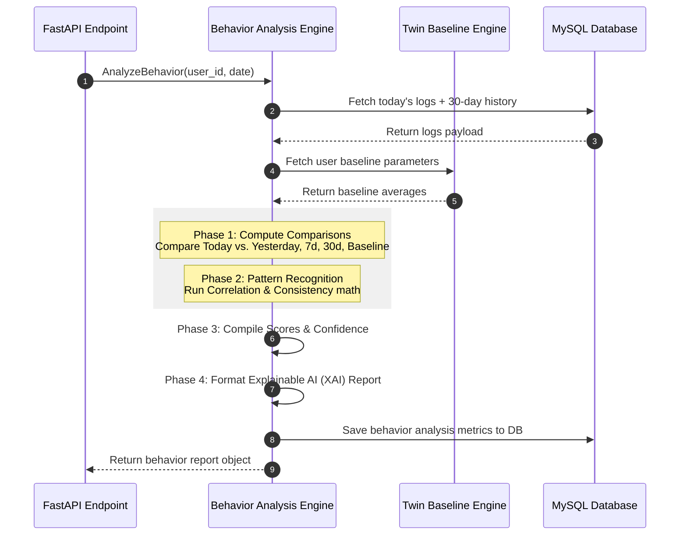

# MindGuard AI Behavior Analysis Engine Blueprint
## Enterprise Behavioral Intelligence, Pattern Recognition, and Correlation Engine

This document details the production-grade architecture for the **Behavior Analysis Engine** (BAE) of MindGuard AI. The engine sits between the Digital Lifestyle Twin and the Stress Estimation Engine, analyzing raw lifestyle logs to detect statistical trends, habit changes, and routine consistency.

---

## 1. Behavior Analysis Architecture

The Behavior Analysis Engine operates as a pipeline, processing raw daily logs alongside the user's historical baseline to construct a detailed behavior report.

```
 [Inputs: Twin State, Daily Logs, History]
                    │
                    ▼
     ┌─────────────────────────────┐
     │ 1. Data Ingestion & Scaling │
     └──────────────┬──────────────┘
                    ▼
     ┌─────────────────────────────┐
     │ 2. Comparison & Drift       │
     │    - PSI Drift Detection    │
     │    - Deviation Matrices     │
     └──────────────┬──────────────┘
                    ▼
     ┌─────────────────────────────┐
     │ 3. Pattern & Correlation    │
     │    - Bedtime shifts         │
     │    - Habit correlations     │
     └──────────────┬──────────────┘
                    ▼
     ┌─────────────────────────────┐
     │ 4. Consistency & Scoring    │
     │    - Compute LSS, RCS, PS   │
     │    - Confidence Engine      │
     └──────────────┬──────────────┘
                    ▼
     ┌─────────────────────────────┐
     │ 5. Explainable AI (XAI)     │
     │    - Text Report Formatter  │
     └──────────────┬──────────────┘
                    │
                    ▼
  [Output: Behavior Report Object] ──► [Input: Stress Engine / DB]
```

---

## 2. Analysis Workflow

The behavior analysis workflow is triggered automatically when a user logs metrics, or as part of a nightly batch job.



---

## 3. Behavior Categories & Parsed Metrics

The engine categorizes user behavior into distinct domains:
*   **Sleep:** Sleep duration and sleep quality ratings.
*   **Routine:** Bedtime and wake-up times.
*   **Exercise:** Active minutes and workout frequencies.
*   **Meditation:** Guided session durations.
*   **Focus:** Focused study and work durations.
*   **Mood:** Daily mood check-in scores.
*   **Journal:** Encryption-safe word counts and sentiment scores.
*   **Device Usage:** Screen time, phone unlocks, and app usage category minutes.

---

## 4. Comparison Engine

The Comparison Engine performs multi-period comparative calculations, comparing the user's current metrics ($X_{t}$) against their baseline averages ($\mu$) to detect habit changes.

| Comparison Target | Formula | Purpose |
| :--- | :--- | :--- |
| **Day-over-Day (DoD)** | $DoD_i = \frac{X_{t} - X_{t-1}}{X_{t-1}}$ | Detects acute daily shifts. |
| **Week-over-Week (WoW)** | $WoW_i = \frac{\overline{X}_{7d} - \overline{X}_{\text{prev\_7d}}}{\overline{X}_{\text{prev\_7d}}}$ | Identifies emerging weekly trends. |
| **Vs. Baseline** | $Dev_i = \frac{X_{t} - \mu_{baseline}}{\mu_{baseline}}$ | Identifies deviations from normal habits. |

---

## 5. Behavior Drift Engine

The Behavior Drift Engine measures gradual shifts in habits over time using the **Population Stability Index (PSI)**. We compare the distribution of daily metrics over the last 14 days against the historical baseline:

$$PSI = \sum \left( (P_{\text{observed}} - P_{\text{baseline}}) \cdot \ln\left(\frac{P_{\text{observed}}}{P_{\text{baseline}}}\right) \right)$$

```
  PSI Value                Drift Classification       Action Taken
  ┌───────────────────────┬──────────────────────────┬────────────────────────┐
  │ PSI < 0.1             │ Stable (No Drift)        │ Keep current baseline  │
  ├───────────────────────┼──────────────────────────┼────────────────────────┤
  │ 0.1 <= PSI < 0.25     │ Moderate Drift           │ Queue adaptation check │
  ├───────────────────────┼──────────────────────────┼────────────────────────┤
  │ PSI >= 0.25           │ Major Drift              │ Trigger baseline update│
  └───────────────────────┴──────────────────────────┴────────────────────────┘
```

---

## 6. Pattern Recognition Workflow

The pattern recognition pipeline detects multi-day habit trends:
1.  **Late-Sleep Pattern:** Triggered when the user's bedtime shifts $> 90$ minutes later than their baseline for three consecutive nights.
2.  **Weekend Anomalies:** Compares weekend habits (e.g. screen time, wake times) against weekday baselines to detect weekend sleep debt or high device usage.
3.  **Low-Productivity Cycle:** Triggered when focus sessions drop $> 50\%$ alongside a $> 40\%$ increase in entertainment app usage over a 5-day period.

---

## 7. Correlation Engine

The Correlation Engine evaluates relationships between habits by calculating the Pearson Correlation Coefficient ($r$) across historical logs:

$$r = \frac{\sum (X_i - \overline{X})(Y_i - \overline{Y})}{\sqrt{\sum (X_i - \overline{X})^2 \sum (Y_i - \overline{Y})^2}}$$

This allows the system to identify personal correlations, such as:
*   `Correlation 1:` Higher screen time correlates with reduced sleep quality ($r = -0.68$).
*   `Correlation 2:` Guided meditation sessions correlate with higher mood ratings ($r = +0.55$).

---

## 8. Consistency Engine

The Consistency Engine measures routine stability using standard deviation indices:

*   **Sleep Consistency Index (SCI):**
    $$SCI = 100 \cdot \left(1.0 - \text{Min}\left(1.0, \frac{\sigma_{\text{bedtime\_hours}}}{3.0}\right)\right)$$
*   **Routine Consistency Index (RCI):** Measures consistency across wake-up times, meditation routines, and exercise schedules.
*   **Mood Stability Index (MSI):** Calculates the variance of daily mood scores; a higher value indicates stable emotional trends.

---

## 9. Behavior Scoring Strategy

The engine calculates normalized scores (0 to 100) to represent different aspects of the user's habits:

### 9.1 Lifestyle Stability Score (LSS)
Measures consistency across sleep, exercise, and hydration habits:

$$LSS = w_1 \cdot SCI + w_2 \cdot \text{Exercise\_Consistency} + w_3 \cdot \text{Water\_Consistency}$$

### 9.2 Productivity Score (PS)
Measures productivity based on focus sessions and app usage statistics:

$$PS = 100 \cdot \left( \frac{\text{Focus\_Duration}}{\text{Baseline\_Focus}} \right) \cdot \left( 1.0 - \frac{\text{Distracting\_App\_Duration}}{\text{Total\_Screen\_Time}} \right)$$

---

## 10. Explainable AI (XAI) Workflow

Every behavior analysis result is structured to include clear explanations, mapping statistical calculations directly to human-readable terms:

```json
{
  "metric_key": "sleep_consistency",
  "observation": "Sleep consistency decreased by 25%.",
  "reason": "Bedtime shifted later by an average of 1.4 hours over the past 5 days.",
  "evidence": {
    "baseline_bedtime": "10:30 PM",
    "observed_average_bedtime": "11:54 PM",
    "std_dev_increase": 0.85
  },
  "confidence": "high"
}
```

---

## 11. Timeline Generation

The Timeline Engine maps events to a user's behavioral history:
*   **Daily Timeline:** Logs daily milestones (e.g. completed a 45-minute focus session, logged water intake).
*   **Weekly Timeline:** Summarizes weekly behavioral events (e.g., *"Sleep consistency recovered after three days of late bedtime"*).
*   **Major Events Detection:** Identifies significant shifts, such as transitions into holidays or exam periods, based on multi-habit changes.

---

## 12. Trend Analysis

Trends are modeled using linear regression slopes over rolling 7-day and 30-day windows, indicating the direction of habit changes:
*   **Sleep Trend:** Slope of sleep duration.
*   **Screen Time Trend:** Slope of daily screen time.
*   **Meditation Trend:** Frequency and duration changes.

---

## 13. Insight Generation

Insights are generated by matching anomalies to templates in memory:
*   *Template 1 (Habit Drift):* *"Your sleep duration has drifted 1.2 hours lower than your normal routine over the past week."*
*   *Template 2 (Positive Habit):* *"Your weekly focus duration has remained consistently above your baseline."*

---

## 14. Positive Reinforcement Strategy

The engine is designed to recognize and reward healthy routines:
*   **Habit Recovery:** Recognizes when a metric returns to baseline after a period of deviation (e.g., *"Your sleep schedule has stabilized after a week of late bedtime"*).
*   **Habit Formation:** Recognizes when the user establishes new healthy habits (e.g. maintaining a 5-day streak of logged meditation).

---

## 15. Confidence Scoring

Calculates the confidence level (low, medium, high, very high) for each behavior report:

$$Confidence = w_1 \cdot \text{Data\_Completeness} + w_2 \cdot \text{Historical\_Days} + w_3 \cdot \text{Pattern\_Stability}$$

*   **Data Completeness:** The percentage of logged metrics for the day.
*   **Historical Days:** Number of baseline training days.
*   **Pattern Stability:** Measured by standard deviation ($\sigma$).

---

## 16. Database Integration

The engine updates these database tables daily:
*   `behavior_analysis_results`: Stores the overall deviation index and confidence score.
*   `behavior_deviations`: Stores normalized $Z$-scores and classification states for each metric.
*   `behavior_alerts`: Stores system alerts triggered by severe anomalies.

---

## 17. FastAPI Integration

The Behavior Analysis Engine exposes the following endpoints:
*   `GET /api/v1/behavior/report/today`: Returns today's behavior report.
*   `GET /api/v1/behavior/drift`: Returns the calculated habit drift index.
*   `GET /api/v1/behavior/correlations`: Returns correlation coefficients across user metrics.

---

## 18. Scalability Strategy

*   **Distributed Calculations:** Heavy analytical tasks are processed asynchronously using **Celery** workers.
*   **Database Partitioning:** The `behavior_deviations` table is partitioned by date (`analysis_date`), keeping index sizes small for fast queries.
*   **Redis Caching:** Behavior reports are cached in Redis to support fast dashboard load times.

---

## 19. Future Machine Learning Integration

*   **PyTorch/TensorFlow Models:** The rule-based pattern recognition engine can be replaced with deep-learning models (e.g. LSTMs or Transformers) trained on time-series logs to predict habit changes.
*   **ONNX Packaging:** Models can be exported to `.onnx` format and run locally inside the FastAPI service using `onnxruntime`.

---

## 20. Development Roadmap

```
  ┌────────────────────────────────────────────────────────┐
  │ Phase 1: Comparison & Consistency math libraries       │
  └───────────────────────────┬────────────────────────────┘
                              │
                              ▼
  ┌────────────────────────────────────────────────────────┐
  │ Phase 2: Anomaly detection pipelines & DB schemas      │
  └───────────────────────────┬────────────────────────────┘
                              │
                              ▼
  ┌────────────────────────────────────────────────────────┐
  │ Phase 3: Correlation & Pattern engines validation      │
  └───────────────────────────┬────────────────────────────┘
                              │
                              ▼
  ┌────────────────────────────────────────────────────────┐
  │ Phase 4: XAI Report generator and integration tests    │
  └────────────────────────────────────────────────────────┘
```

1.  **Phase 1 (Foundations):** Write helper classes for statistical comparison, consistency scoring, and moving standard deviations.
2.  **Phase 2 (Anomaly Pipeline):** Integrate the anomaly detection pipeline, save daily deviations to the database, and verify index performance.
3.  **Phase 3 (Pattern Recognition):** Implement correlation formulas and test pattern matching against simulated datasets.
4.  **Phase 4 (XAI Integration):** Build the explainable report generator and connect the engine output to the Stress Estimation Engine inputs.
