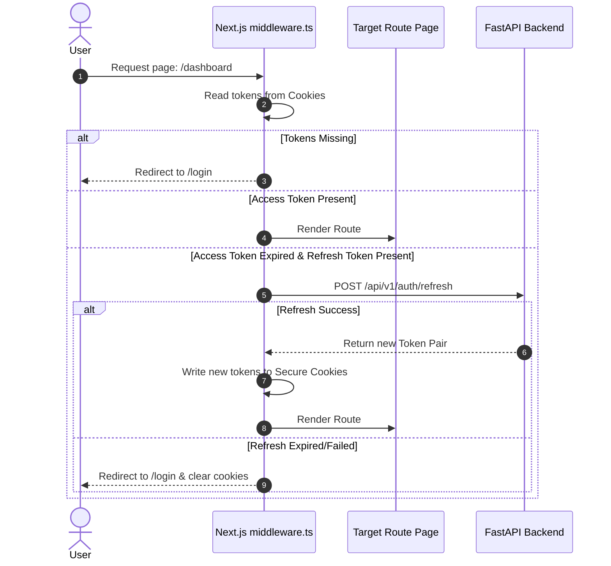

# MindGuard AI Website Design Blueprint
## Next.js 15 App Router & React 19 Production Design

This document details the production-ready frontend website architecture for MindGuard AI. Built with Next.js 15, React 19, TypeScript, and TailwindCSS, the web client features ShadCN UI widgets, React Query data fetching, Recharts analytics, and Framer Motion micro-animations.

---

## 1. Complete Website Architecture

The frontend leverages Next.js 15's **App Router**, utilizing React Server Components (RSC) for static layouts and search engine optimization, and Client Components (RCC) for interactive states (charts, chats, forms).

```
                      [ Client Web Browser ]
                                │
          ┌─────────────────────┴─────────────────────┐
          ▼ (RSC - Server View)                       ▼ (RCC - Client View)
 ┌─────────────────┐                        ┌──────────────────┐
 │ Public Layout   │                        │ Interactive Page │
 │ Landing Pages   │                        │ Charts / Chat    │
 │ Static Metadata │                        │ Forms Validation │
 └─────────────────┘                        └─────────┬────────┘
                                                      │ Requests Data
                                                      ▼
                                            [ React Query Cache ]
                                                      │ Cache Miss
                                                      ▼
                                            [ Axios API Service ]
                                                      │ HTTPS over WAN
                                                      ▼
                                            [ FastAPI Gateway ]
```

---

## 2. Folder Structure

```
website/
├── public/                       # Static assets (logos, icons, global robots.txt)
├── src/
│   ├── app/                      # Next.js App Router root
│   │   ├── layout.tsx            # Global providers, fonts, and CSS styles
│   │   ├── page.tsx              # Landing homepage
│   │   ├── (public)/             # Public access pages
│   │   │   ├── about/
│   │   │   └── faq/
│   │   ├── (auth)/               # Authentication routing group
│   │   │   ├── login/
│   │   │   ├── register/
│   │   │   └── verify-email/
│   │   ├── (dashboard)/          # Authenticated App Shell group
│   │   │   ├── layout.tsx        # App sidebar, notifications navbar wrapper
│   │   │   ├── dashboard/        # Main landing app view
│   │   │   ├── lifestyle/        # Habit tracker logs
│   │   │   ├── mood/             # Mood analytics
│   │   │   └── journal/          # Journal records
│   │   ├── (digital-twin)/       # Digital Twin and Stress modules
│   │   │   ├── twin/
│   │   │   └── stress/
│   │   ├── (ai)/                 # AI Chat interface
│   │   │   └── coach/
│   │   └── (admin)/              # Administrative access views
│   ├── components/               # UI Component Hierarchy
│   │   ├── ui/                   # Primitive ShadCN base components (Button, Dialog...)
│   │   ├── cards/                # Premium custom layout cards (StressCard, TwinCard)
│   │   ├── charts/               # Recharts analytic wrappers
│   │   ├── forms/                # Form validation assemblies
│   │   └── layout/               # Navbars, Sidebars, Footers
│   ├── hooks/                    # Custom custom React hooks (useAuth, useStressReport)
│   ├── lib/                      # Helper initializations (tailwind-merge, utils)
│   ├── services/                 # Axios clients and API interface methods
│   ├── store/                    # Local client state managers (Zustand)
│   ├── types/                    # Common TypeScript type interfaces
│   ├── providers/                # Global React context containers
│   └── middleware.ts             # Route guard middleware
├── tailwind.config.ts
├── package.json
└── tsconfig.json
```

---

## 3. Layout Design

We implement three distinct layouts using Next.js nested folder hierarchies:

```
                           [ Root Layout ]
                       React Query & Theme Provider
                                  │
         ┌────────────────────────┼────────────────────────┐
         ▼                        ▼                        ▼
 ┌──────────────┐         ┌──────────────┐         ┌──────────────┐
 │Public Layout │         │Dashboard Shell│        │ Admin Shell  │
 │Navbar/Footer │         │Sidebar/Header│         │Admin Nav/Logs│
 └──────────────┘         └──────────────┘         └──────────────┘
```

1.  **Public Layout (`/src/app/(public)/layout.tsx`):** Standard landing page wrapper. Includes a sticky navigation bar with a dark/light mode toggle and a CTA login button, with a footer at the bottom of the page.
2.  **Dashboard Shell Layout (`/src/app/(dashboard)/layout.tsx`):** App shell interface featuring a collapsible left navigation sidebar, a top header containing notification dropdown panels, and a search input for journal queries.
3.  **Admin Shell Layout (`/src/app/(admin)/layout.tsx`):** Secure dashboard interface tailored for system administrators, displaying feature flag toggles, database health statuses, audit trails, and user management tables.

---

## 4. Routing Structure

We isolate app routing using Next.js **Route Groups** (folders enclosed in parentheses). This allows pages to share layouts and route guards without altering the path string in the browser:

*   **Public Routing:** `/about`, `/faq` (no prefix, utilizes `(public)` layout)
*   **Authentication Routing:** `/login`, `/register` (utilizes `(auth)` layout)
*   **Dashboard Routing:** `/dashboard`, `/lifestyle`, `/mood`, `/journal` (utilizes `(dashboard)` layout)
*   **Digital Twin Routing:** `/twin`, `/stress` (utilizes `(digital-twin)` layout)
*   **AI Coach Routing:** `/coach` (utilizes `(ai)` layout)
*   **Admin Routing:** `/admin/dashboard` (utilizes `(admin)` layout)

---

## 5. Authentication Design

Next.js route protection is handled by middleware running on edge servers:



---

## 6. Dashboard Design

The dashboard is designed as a modular CSS grid. It features:
*   **Today's Wellness Score (Header Widget):** Displays the user's overall wellness score using a circular progress visualization.
*   **Stress Likelihood Card:** Displays the current stress probability estimation (low, moderate, high) along with the primary contributing factor.
*   **Lifestyle Twin Card:** Visualizes the deviation between today's habits and the baseline profile.
*   **Quick Actions Panel:** Provides shortcuts to quickly log metrics (e.g. water intake, mood) or start a focus session.

---

## 7. Component Architecture

We structure components according to atomic design principles:

```
  [ Atoms ]       ──► [ Molecules ] ──► [ Organisms ]      ──► [ Templates ]
  Buttons/Inputs      Form Fields       Dashboard Card Grid     App Layout Shell
```

*   **Atoms:** Stateless primitives styled with Tailwind and variants (e.g., `<Button>`, `<Input>`, `<Badge>` in `components/ui`).
*   **Molecules:** Compound components containing minimal internal state (e.g., `<FormField>`, `<MoodEmojiGrid>`).
*   **Organisms:** Complex components that integrate with local state managers or API hooks (e.g., `<PomodoroTimer>`, `<JournalRichEditor>`).

---

## 8. API Layer Design

API requests are managed by an Axios instance configured with request and response interceptors to handle token injection and automatic session refreshes.

```typescript
export const apiClient = axios.create({
  baseURL: process.env.NEXT_PUBLIC_API_URL,
  withCredentials: true, // Sends secure cookies containing refresh tokens
});

apiClient.interceptors.request.use((config) => {
  const token = useAuthStore.getState().accessToken;
  if (token) {
    config.headers.Authorization = `Bearer ${token}`;
  }
  return config;
});
```

The response interceptor catches `HTTP 401 Unauthorized` responses and attempts to obtain a new access token, retrying the failed request if successful.

---

## 9. State Management Strategy

```
  [ Server Cache State (React Query) ] ◄──► [ Local UI State (Zustand) ]
  - Manages API responses                  - Collapsible sidebar state
  - Handles cache invalidation             - Local theme values
  - Controls mutation updates              - Active timer states
```

1.  **Server Cache State (React Query):** Manages API responses, automatic cache invalidation (e.g., invalidating `today's logs` queries after submitting a new log), and query retries.
2.  **Local UI State (Zustand):** Manages local-only states such as sidebar expand/collapse status, theme preferences, and the active Pomodoro timer state.

---

## 10. Theme Architecture

Themes are managed using **Next-Themes** and Tailwind variables, allowing smooth transitions between dark and light modes.

```css
@theme {
  --color-primary: hsl(var(--primary));
  --color-background: hsl(var(--background));
  --color-surface: hsl(var(--surface));
}

:root {
  --background: 210 20% 98%;
  --primary: 172 100% 21%; /* Dark Teal */
}

.dark {
  --background: 222 47% 11%; /* Navy */
  --primary: 172 66% 61%;  /* Mint */
}
```

---

## 11. Chart Strategy

Data visualizations are built using **Recharts**, configured to be responsive across different screen sizes.

*   **Stress & Mood Trends:** Spline area charts showing how daily stress likelihood and mood scores correlate over time.
*   **Lifestyle Comparison:** Double bar charts comparing today's logs (e.g., screen time, sleep duration) against the user's baseline.
*   **Interactive Tooltips:** Custom tooltips displaying detailed metrics on hover, styled with glassmorphism backgrounds.

---

## 12. Form Validation Strategy

Forms are validated on the client side using **React Hook Form** and **Zod** validation schemas.

```typescript
export const loginSchema = zod.object({
  email: zod.string().email("Invalid email format"),
  password: zod.string().min(8, "Password must be at least 8 characters"),
  rememberMe: zod.boolean().default(false),
});

type LoginFormValues = zod.infer<typeof loginSchema>;
```

This ensures user input is validated before being sent to the backend, reducing unnecessary API traffic.

---

## 13. Error Handling Strategy

*   **React Error Boundaries:** Pages are wrapped in Error Boundaries, displaying a fallback UI instead of crashing the entire application.
*   **Fallback Pages:** Custom layouts for `404 (Not Found)` and `500 (Server Error)` pages.
*   **Loading Feedback:** React Suspense boundaries render skeleton layouts while page components fetch required data.
*   **User Feedback:** API errors and validation failures trigger visual Toast alerts.

---

## 14. Responsive Design Strategy

We use Tailwind's responsive prefixes (`sm`, `md`, `lg`, `xl`, `2xl`) to support all device sizes:
*   **Mobile Screens (`< 768px`):** The sidebar collapses into a slide-out drawer menu, and multi-column dashboard layouts stack into a single column.
*   **Desktop Screens (`>= 1024px`):** Displays the persistent sidebar and a 3-column dashboard grid.
*   **High-Resolution Monitors (`>= 1536px`):** Layout widths are capped at `max-w-7xl` to prevent content stretching.

---

## 15. Security Strategy

*   **XSS Mitigation:** React automatically escapes output variables to prevent Cross-Site Scripting (XSS). Custom inputs sanitize HTML payloads before insertion.
*   **Cookie Security:** Refresh tokens are saved in secure cookies:
    *   `HttpOnly`: Prevents client-side scripts from reading the cookie.
    *   `Secure`: Ensures the cookie is only transmitted over encrypted (HTTPS) connections.
    *   `SameSite=Strict`: Protects against Cross-Site Request Forgery (CSRF) attacks.

---

## 16. SEO Strategy

SEO configuration utilizes Next.js static metadata definitions to optimize page discoverability.

```typescript
export const metadata: Metadata = {
  title: "MindGuard AI | Digital Lifestyle Twin",
  description: "Continuously learn your lifestyle patterns, evaluate daily stress indicators, and receive personalized coaching.",
  openGraph: {
    title: "MindGuard AI",
    images: [{ url: "/assets/og-image.png" }],
  },
};
```

A dynamic sitemap generator updates page routing maps daily, outputting standardized maps to the `/public` root.

---

## 17. Performance Optimization Plan

1.  **Server Components (RSC):** Landing pages, FAQ documents, and layout templates are rendered on the server, minimizing the bundle size sent to the client.
2.  **Dynamic Imports:** Heavy client modules (such as charting libraries or rich-text editors) are loaded dynamically using `next/dynamic` only when required.
3.  **Next.js Image Component (`next/image`):** Automatically resizes, compresses, and lazy-loads images, serving them in modern web formats (WebP).

---

## 18. Vercel Deployment Configuration Files

### `next.config.js`
```javascript
/** @type {import('next').NextConfig} */
const nextConfig = {
  reactStrictMode: true,
  images: {
    domains: ["api.mindguard.ai", "render.com"],
  },
  // Enforces clean output packaging
  output: "standalone",
};

module.exports = nextConfig;
```

### Required Vercel Environment Variables:
*   `NEXT_PUBLIC_API_URL`: Points to the production FastAPI endpoint (e.g. `https://api.mindguard.ai/api/v1`).
*   `NEXT_PUBLIC_APP_ENV`: Set to `production` to disable development logs and diagnostics.

---

## 19. Future Scalability Plan

*   **PWA Integration:** Configure `next-pwa` to enable installability on desktop and mobile platforms, caching static assets for offline use.
*   **Internationalization (i18n):** Implement sub-path routing (e.g., `/es/dashboard`, `/fr/dashboard`) and manage translations using React i18next.
*   **WebSockets for Coach:** Upgrade the AI Coach chat component to use WebSockets to enable streaming chat responses.

---

## 20. Website Development Roadmap

```
  ┌────────────────────────────────────────────────────────┐
  │ Phase 1: Tailwind CSS, ShadCN & Theme Setup            │
  └───────────────────────────┬────────────────────────────┘
                              │
                              ▼
  ┌────────────────────────────────────────────────────────┐
  │ Phase 2: Axios Client, Authentication & Route Guards   │
  └───────────────────────────┬────────────────────────────┘
                              │
                              ▼
  ┌────────────────────────────────────────────────────────┐
  │ Phase 3: Dashboard Layout & Recharts Analytics         │
  └───────────────────────────┬────────────────────────────┘
                              │
                              ▼
  ┌────────────────────────────────────────────────────────┐
  │ Phase 4: Daily Log Forms & Journal Editor Integration  │
  └───────────────────────────┬────────────────────────────┘
                              │
                              ▼
  ┌────────────────────────────────────────────────────────┐
  │ Phase 5: AI Coach Chat Screen & Admin Settings         │
  └────────────────────────────────────────────────────────┘
```

1.  **Phase 1 (Setup):** Configure Tailwind, initialize ShadCN UI tokens, set up the Next-Themes provider, and build global CSS variables.
2.  **Phase 2 (Auth & Gateway):** Create authentication forms, configure the Axios client interceptors, and write route guard middleware to protect paths.
3.  **Phase 3 (Dashboard & Charts):** Build the sidebar layout shell, design widget components, and implement Recharts analytic dashboards.
4.  **Phase 4 (Logs & Editor):** Design daily tracking forms, integrate the rich-text editor, and display sentiment score charts.
5.  **Phase 5 (Coach & Launch):** Design the AI Coach chat view with typing animations, build the Admin settings panel, and deploy the application to Vercel.
